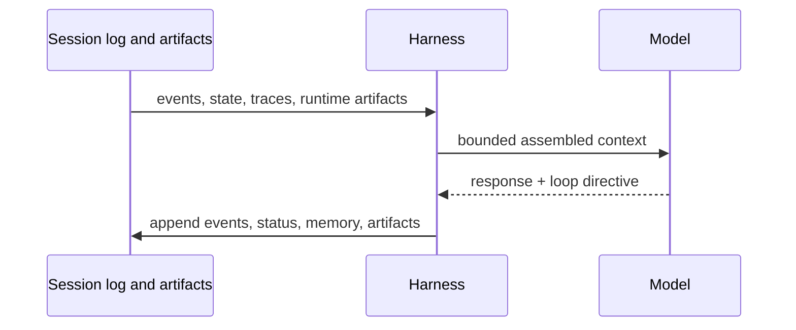
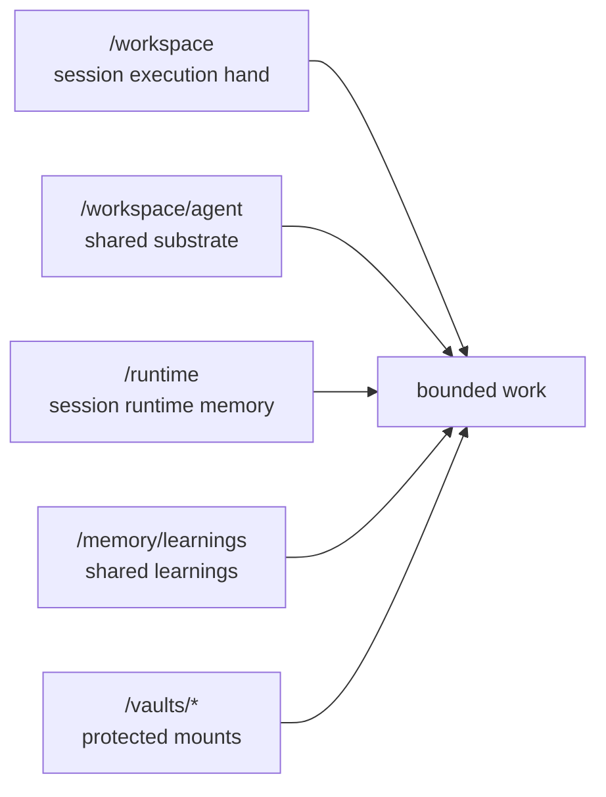
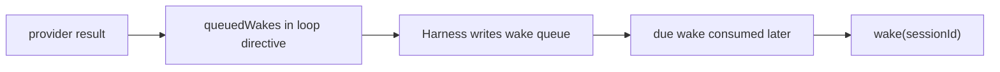
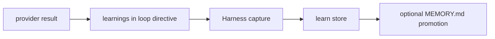
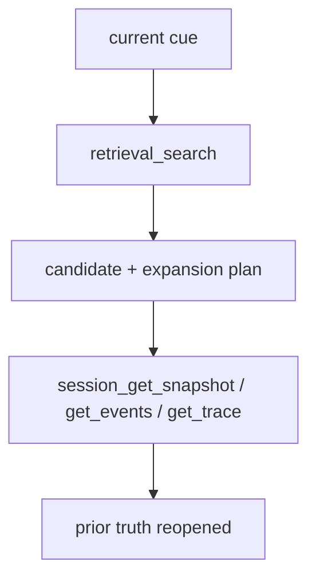
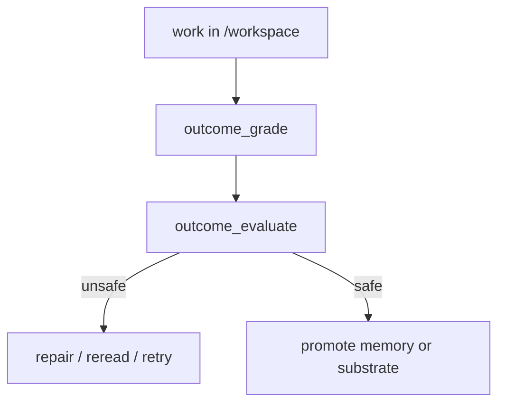

This page is the canonical explanation of how the openboa `Agent` runtime operates.

Use [Agent](./agent.md) for the meaning of the layer.
Use [Agent Capabilities](./agents/capabilities.md) for the capability model.
Use [Agent Resilience](./agents/resilience.md) when the main question is recovery behavior under pause, retry, requeue, or replay.
Use this page when you want the runtime contract: what exists, how a wake runs, what gets persisted, and how durable improvement works.

## Runtime contract in one sentence

The openboa Agent runtime is a session-first system in which:

- a durable `Session` is the running object
- new session events act as the public ingress surface
- a worker consumes pending or due activations for a session
- `wake(sessionId)` remains the low-level execution step for one bounded `Harness` loop
- the run uses mounted resources, tools, retrieval, shell, and outcome posture
- the run writes new events and runtime artifacts back into the same durable session

## The one-wake flow

```mermaid
flowchart LR
  A["append session event"] --> B["activation available"]
  B --> C["worker consumes activation"]
  C --> D["wake(sessionId)"]
  D --> E["load session truth"]
  E --> F["assemble bounded context"]
  F --> G["provider run"]
  G --> H["interpret loop directive"]
  H --> I["append events + write runtime artifacts"]
  I --> J["sleep / requires_action / queued revisit / done"]
```



This is the smallest useful picture of the runtime.

The most important consequences are:

- the prompt is disposable
- the session is durable
- public callers append events rather than constructing ad-hoc wake payloads

## Core runtime objects

### `AgentDefinition`

The durable definition of one worker identity.

It answers:

- which provider backend to use
- which model to prefer
- which bootstrap substrate belongs to this Agent

### `Environment`

The reusable execution contract.

It answers:

- what sandbox exists
- what resources are mounted
- what permission and vault posture apply

### `Session`

The primary running object.

A session owns:

- its `sessionId`
- one `agentId`
- one `environmentId`
- one append-only event log
- stop reason and status
- mounted resources
- runtime artifacts
- pending action state
- optional parent-child lineage
- active outcome posture

### `SessionEvent`

The append-only event stream for a session.

That stream is the durable log the runtime interrogates before each wake.

### `Harness`

The bounded brain loop.

For one wake it:

1. loads the session
2. reads pending work
3. assembles bounded context
4. calls the provider
5. interprets the loop directive
6. appends new events
7. updates runtime artifacts

### `Sandbox`

The bounded execution hand behind filesystem and shell work.

### `ToolDefinition`

The stable callable surface for managed, MCP, and custom tools.

## Runtime objects versus prompt view

The session is not the model context window.



This is why the runtime can:

- survive context pressure
- reopen prior truth
- keep cross-session reuse separate from prompt compaction

## Status and stop model

Current session statuses:

- `idle`
- `running`
- `rescheduling`
- `terminated`

Current stop reasons:

- `idle`
- `requires_action`
- `rescheduling`
- `terminated`

`requires_action` is the pause seam for:

- custom tool results
- managed tool confirmations

That means pause/resume stays inside the session model instead of becoming hidden UI state.

## Default storage layout

One session currently lives under:

```text
.openboa/agents/<agent-id>/sessions/<session-id>/
  session.json
  events.jsonl
  runtime/
    checkpoint.json
    session-state.md
    working-buffer.md
  wake-queue.jsonl
```

Meaning:

- `session.json`
  - durable session state
- `events.jsonl`
  - append-only event journal
- `runtime/`
  - continuity and execution artifacts
- `wake-queue.jsonl`
  - bounded proactive revisits

## Runtime artifacts

The runtime also materializes a filesystem-readable view of the current session under:

```text
/workspace/.openboa-runtime/
```

These artifacts include:

- environment posture
- mounted resources
- tools catalog
- vault catalog
- context budget
- outcome posture
- permission posture
- shell state and shell history
- last shell output
- event feed and traces
- session relations

The purpose is simple:

- the Agent should be able to reread important runtime facts from the filesystem
- not every important runtime fact should exist only in prompt text

## Mount model

The current runtime uses a shared-substrate plus session-hand model.



This gives the Agent:

- one writable session-local execution hand
- one durable shared substrate
- one session-local runtime surface
- one agent-level learning surface
- protected vault mounts

## Proactive execution

The runtime already supports bounded proactive continuation.

That means one run may request a later revisit of the same session.



Why it exists:

- many tasks need waiting, checking back, or following up
- the Agent should not need a fresh external nudge for every bounded next step

What it does not mean:

- unlimited hidden background autonomy
- a second scheduling system outside the session model

## Learning loop

The runtime also supports durable learning capture.



Current learning kinds:

- `lesson`
- `correction`
- `error`

Why it exists:

- session-local continuity is not enough for durable improvement
- the Agent needs a reusable memory surface across sessions

## Retrieval and reread

Cross-session reuse does not depend on one irreversible summary.

Instead the runtime uses:

- cheap deterministic candidate retrieval
- bounded reread of prior truth



This keeps the runtime aligned with the session-first rule:

- retrieval candidates are hints
- reopened session truth is truth

## Outcome and promotion loop

Durable shared improvement is not implicit.



This is why the runtime separates:

- current session work
- current task posture
- durable promotion

Shared mutation and durable learning should not happen just because one run feels confident.

## Common operating loop

Typical builder flow:

1. create a session
2. send a message or define an outcome
3. wake the session
4. inspect status, traces, context, shell, or memory
5. work under `/workspace`
6. promote durable shared change only when outcome and permission posture say it is safe

Example CLI flow:

```bash
pnpm openboa agent session create --name alpha
pnpm openboa agent session send --session <uuid-v7> --message "Review the current state."
pnpm openboa agent wake --session <uuid-v7>
pnpm openboa agent session status --session <uuid-v7>
pnpm openboa agent session events --session <uuid-v7> --limit 10
```

## What this page does not try to cover

This page explains the runtime contract.

It does not try to be:

- the file-by-file steering guide
- the full internal architecture page
- the exhaustive tool catalog

For those, read:

- [Agent Workspace](./agents/workspace.md)
- [Agent Memory](./agents/memory.md)
- [Agent Context](./agents/context.md)
- [Agent Resilience](./agents/resilience.md)
- [Agent Bootstrap](./agents/bootstrap.md)
- [Agent Architecture](./agents/architecture.md)
- [Agent Tools](./agents/tools.md)

## Reading order

If you want to keep going:

1. read [Agent Capabilities](./agents/capabilities.md) if you want the runtime logic explained capability-by-capability
2. read [Agent Memory](./agents/memory.md), [Agent Context](./agents/context.md), and [Agent Resilience](./agents/resilience.md) for the concrete runtime surfaces
3. read [Agent Architecture](./agents/architecture.md) for the internal structure
4. read [Agent Sessions](./agents/sessions.md) for session lifecycle and truth
5. read [Agent Sandbox](./agents/sandbox.md) and [Agent Tools](./agents/tools.md) for the execution surface
