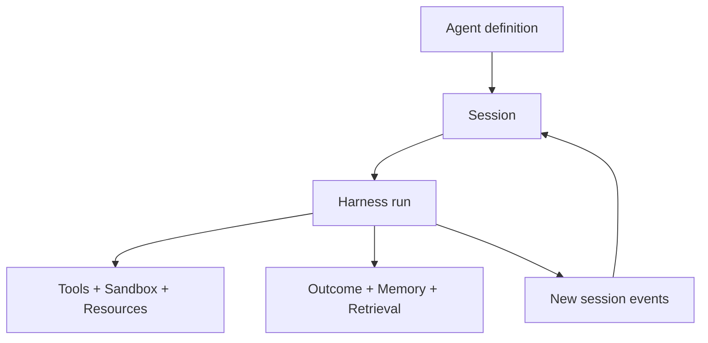

`Agent` is the reusable worker runtime in openboa.

It is not one app surface.
It is the durable runtime that lets one worker identity keep working across wakes, reuse prior work, operate through a filesystem-native execution hand, and improve safely over time.

This page explains the meaning of the layer.
It is the right place to start if you want to understand the Agent system itself before reading runtime details or code structure.

## Why the Agent layer exists

openboa does not want worker behavior to be defined by whichever upper-layer product surface happens to exist today.

If one surface owns the worker contract, the runtime becomes shape-locked to that surface.
That makes the system harder to reuse, harder to reason about, and harder to evolve.

The Agent layer exists to protect one reusable runtime contract:

- a durable session is the running object
- one wake is a bounded run over that session
- execution happens through mounted resources and tools
- durable improvement is explicit instead of accidental

This means the Agent layer should remain useful even if the surrounding product surfaces change completely.

## What an Agent is

An openboa Agent is:

- session-first
- long-running
- filesystem-native
- tool-using
- capable of proactive revisits
- capable of durable learning
- able to reopen prior truth instead of trusting only prompt-local summaries

An openboa Agent is not:

- a chat transcript with tools bolted on
- a single prompt string
- a single app surface
- a hidden background process that mutates shared state without gates

## Core mental model

Read it this way:

- the `Agent definition` is the reusable worker identity
- the `Session` is the durable running object
- the `Harness run` is one bounded interpretation of the current session state
- the runtime works through mounted resources, tools, memory, retrieval, and outcome posture
- every run writes back into the same session truth

## What the Agent layer gives you

Today the Agent layer gives you:

- a durable `Session` model
- a bounded `Harness` loop
- an `Environment` and `Sandbox` execution hand
- attached `Resources` such as execution workspace, shared substrate, runtime artifacts, and vault mounts
- managed `Tools` for navigation, retrieval, shell, memory, and promotion
- durable `Learning` capture and optional memory promotion
- bounded `Proactive` revisits through queued wakes
- outcome-aware self-improvement and promotion gates

These are not separate products.
They are one runtime seen from different seams.

## The design logic

The Agent layer is built around four rules.

### 1. Session truth is durable

The session is the source of runtime truth.
The prompt is only a bounded view assembled for one wake.

### 2. Execution is filesystem-native

The Agent should be able to work through mounts, files, shell state, and runtime artifacts rather than depending only on prompt text.

### 3. Retrieval reopens prior truth

Cross-session reuse should happen through retrieval and reread, not through irreversible compaction becoming the only memory model.

### 4. Durable improvement must be gated

The Agent may improve itself, but durable shared substrate and shared memory should only change through explicit promotion paths.

## The two capability pairs that matter most

Two pairs explain most of the runtime:

- `session truth` and `retrieval`
- `proactive continuation` and `learning`

These are separate for a reason.

### Session truth and retrieval

The runtime keeps truth in the session log and runtime artifacts.
Retrieval exists so the Agent can reopen the parts of prior truth that matter to the current run.

### Proactive continuation and learning

`Proactive` means the Agent can schedule its own later revisit.
`Learning` means the Agent can convert runtime experience into durable lessons.

They solve different problems:

- proactive without learning keeps moving but does not improve
- learning without proactive continuation remembers lessons but behaves like a one-shot worker

Read [Agent Capabilities](./agents/capabilities.md) for the detailed breakdown.

## The durable steering substrate

Every Agent has a shared workspace substrate that holds bootstrap files such as:

- `AGENTS.md`
- `SOUL.md`
- `TOOLS.md`
- `IDENTITY.md`
- `USER.md`
- `HEARTBEAT.md`
- `BOOTSTRAP.md`
- `MEMORY.md`

These files exist so durable steering and memory are:

- visible from the filesystem
- inspectable by the runtime
- editable without changing runtime code
- separable from live session artifacts

This is why Agent steering is not just one opaque prompt blob.

Read [Agent Bootstrap](./agents/bootstrap.md) for the full model.

## What the Agent layer does not own

The Agent layer should not become the owner of:

- application-specific routing semantics
- product-specific publication semantics
- broader organizational state
- delivery-specific presentation of evidence

Those may consume the Agent runtime, but they should not define it.

## How to read the Agent docs

The Agent docs are organized from meaning to contract to internal structure.

### 1. Start here

- [Agent](./agent.md)
  - what the layer is and why it exists
- [Agent Capabilities](./agents/capabilities.md)
  - what the runtime can actually do and why those capabilities matter

### 2. Then read the runtime contract

- [Agent Runtime](./agent-runtime.md)
  - the public runtime model and operating flow
- [Agent Memory](./agents/memory.md)
  - durable shared memory versus session-local memory
- [Agent Context](./agents/context.md)
  - bounded prompt view versus durable session truth
- [Agent Resilience](./agents/resilience.md)
  - how the runtime pauses, retries, requeues, and resumes
- [Agent Bootstrap](./agents/bootstrap.md)
  - durable steering files and system prompt assembly

### 3. Then read the internal architecture

- [Agent Architecture](./agents/architecture.md)
  - layer model, storage model, mounts, promotion flow, code map

### 4. Then use the detail pages as references

- [Agent Sessions](./agents/sessions.md)
- [Agent Environments](./agents/environments.md)
- [Agent Resources](./agents/resources.md)
- [Agent Harness](./agents/harness.md)
- [Agent Sandbox](./agents/sandbox.md)
- [Agent Tools](./agents/tools.md)

## Reading goal

If these docs are doing their job, you should be able to answer:

- what an openboa Agent is
- why the runtime is session-first
- where durable steering lives
- where live execution state lives
- how resilience works
- how proactive revisits work
- how learning works
- how prior truth is reopened
- how shared durable improvement stays safe

Everything else in the Agent docs is there to support those answers.
