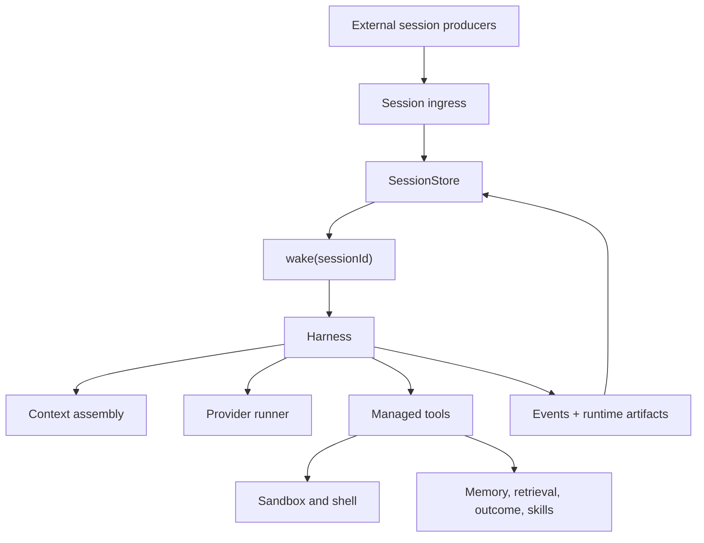
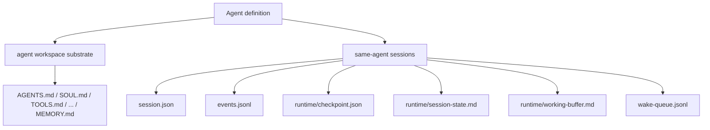
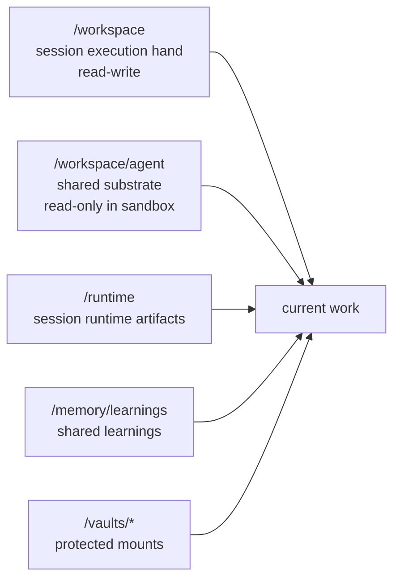
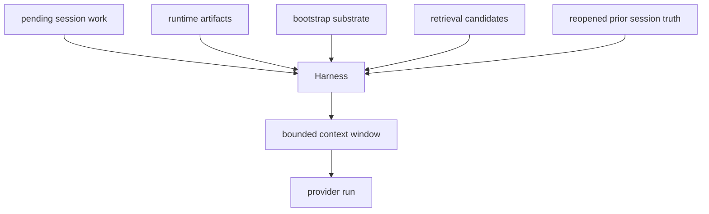
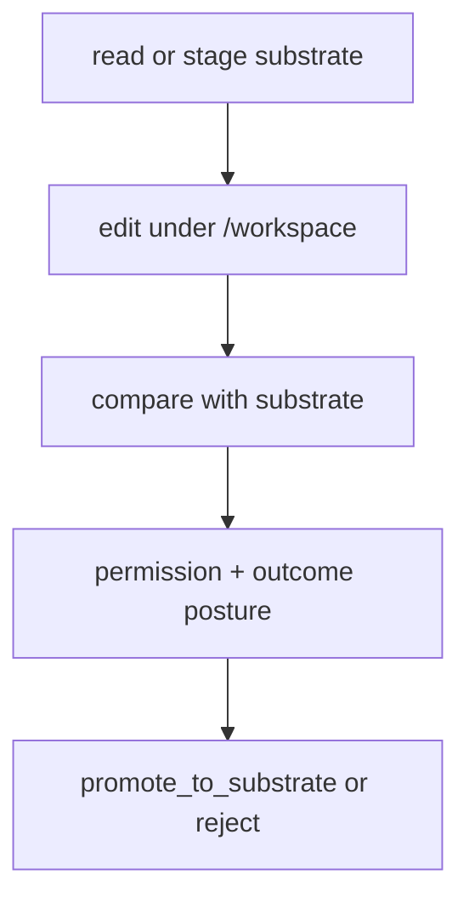
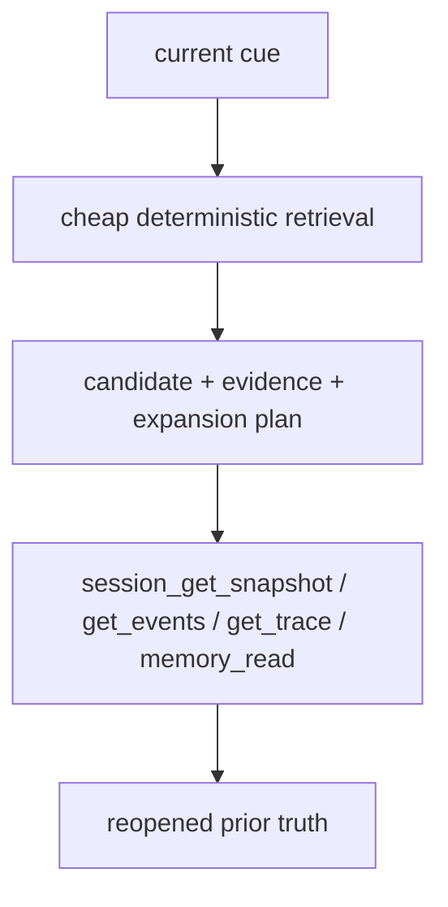
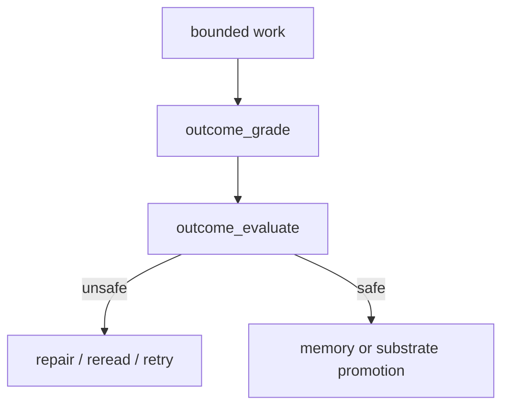

# Agent Architecture

This page explains the internal structure of the openboa `Agent` runtime.

Use [Agent](../agent.md) to understand what the layer is.
Use [Agent Runtime](../agent-runtime.md) to understand the public contract.
Use this page when you want to understand how the runtime is actually built and why the code is organized the way it is.

## Design axioms

The current architecture is built around six axioms.

### 1. Session truth is durable

The session log and runtime artifacts are the durable object.
The prompt is only one bounded projection.

### 2. One wake is bounded

A wake should do one bounded amount of work and then:

- continue later
- pause for action
- finish
- reschedule

### 3. Execution should feel like an environment

The Agent should work through mounts, files, shell, and runtime artifacts rather than only through prompt text.

### 4. Shared mutation must be explicit

Anything durable and shared across sessions should have a visible promotion path.

### 5. Retrieval should reopen truth

Cross-session reuse should prefer rereading prior truth over trusting one compacted summary.

### 6. Improvement should be evaluable

The runtime must distinguish:

- work
- grade
- evaluate
- promote

Otherwise self-improvement becomes self-reinforcement.

## Layer map

The main boundary is:

- external systems decide why a session matters
- the Agent runtime decides how one bounded run happens

## Runtime surfaces

The runtime is easier to understand when split into four surfaces.

### 1. Truth surface

This is the durable source of runtime truth.

Includes:

- `session.json`
- `events.jsonl`
- runtime memory
- wake queue

### 2. Execution surface

This is where current work happens.

Includes:

- session workspace
- shell
- read and write tools

### 3. Recall surface

This is how the Agent reopens prior work.

Includes:

- retrieval pipeline
- memory search
- session search
- trace reread

### 4. Improvement surface

This is how the Agent becomes better without corrupting durable shared state.

Includes:

- outcome grade
- outcome evaluate
- learning capture
- memory promotion
- substrate promotion

## Storage model

Read this split carefully:

- the Agent definition owns durable bootstrap substrate
- each session owns its own truth and continuity
- agent-level learning survives across sessions
- session-local scratch does not become agent-level truth automatically

## Mount topology

The runtime relies on this split.

### `/workspace`

The writable session-local execution hand.

This is where the Agent should feel the freest.

### `/workspace/agent`

The shared durable substrate.

This is readable from the session, but normal sandbox mutation should not directly overwrite it.

### `/runtime`

Session runtime continuity and materialized runtime posture.

### `/memory/learnings`

Agent-level learnings surface.

### `/vaults/*`

Protected mounts for secret-bearing material.

## Context assembly

The runtime does not keep one ever-growing prompt.

That means context management lives in the harness, not in the session itself.

The session guarantees:

- durable truth
- interrogable events
- mounted resources

The harness decides:

- which truth to reopen now
- which hints to include
- how to stay inside a bounded prompt budget

## Promotion loop

Shared durable change is a separate architectural path.

This loop exists so the runtime can have:

- flexible current-session execution
- conservative shared mutation

at the same time.

## Retrieval loop

The retrieval model is intentionally layered.

This is why the runtime can stay session-first without making context compaction the only recall mechanism.

## Outcome and improvement loop

This loop is the architecture-level answer to self-improvement.

The runtime can improve over time, but durable shared consequences are gated.

## Code map

High-signal source locations:

- `src/agents/sessions/`
  - session store, session search, context selection
- `src/agents/runtime/`
  - harness, orchestration, loop directive, wake handling
- `src/agents/tools/`
  - managed runtime tools and permission posture
- `src/agents/sandbox/`
  - local execution hand and shell integration
- `src/agents/memory/`
  - runtime memory, learnings store, memory registry
- `src/agents/retrieval/`
  - retrieval pipeline, evidence merge, expansion planning
- `src/agents/resources/`
  - mount topology, staging, compare, promotion
- `src/agents/skills/`
  - skill discovery and skill reads
- `src/agents/outcomes/`
  - outcome grade and evaluate logic
- `src/agents/environment/`
  - bootstrap and environment contract assembly

## What stays outside the Agent core

The following are intentionally not Agent primitives:

- application-specific routing
- application-specific publication
- domain-specific shared business truth
- external delivery semantics

The Agent runtime should be reusable even when those change.

## Reading order from here

After this page:

1. read [Agent Bootstrap](./bootstrap.md) for durable steering files
2. read [Agent Sessions](./sessions.md) for the session contract
3. read [Agent Sandbox](./sandbox.md) and [Agent Tools](./tools.md) for the execution surface
4. read [Agent Harness](./harness.md) when you need the bounded run implementation responsibilities
