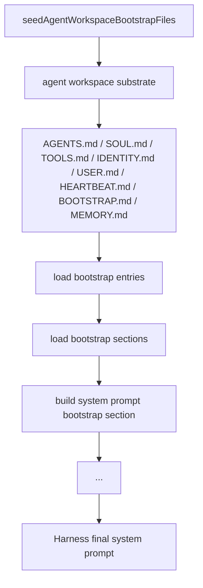
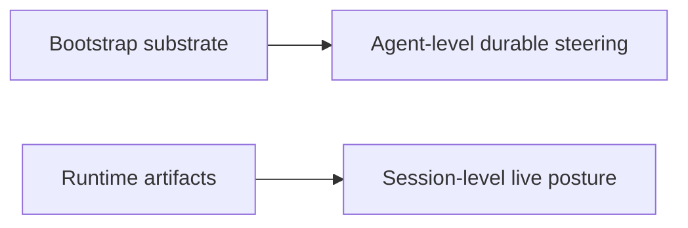
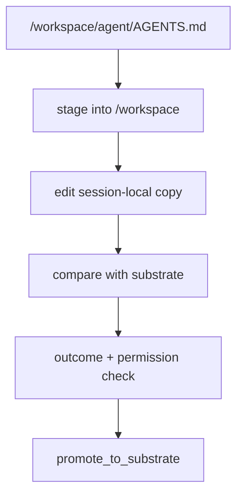

# Agent Bootstrap


This page explains the bootstrap substrate for the openboa `Agent`.

Use this page when you want to understand:

- where `AGENTS.md`, `SOUL.md`, and `MEMORY.md` are defined
- why these files exist as files instead of only as hard-coded prompt text
- how bootstrap files become part of the system prompt
- how bootstrap differs from runtime artifacts
- how shared steering files are safely improved over time

## What bootstrap means in openboa

The Agent runtime has two kinds of durable markdown around it:

- bootstrap files
  - durable steering and memory that belong to the Agent itself
- runtime artifacts
  - generated state that belongs to one current session

That distinction is critical.

Bootstrap files answer:

- who is this Agent
- what stable posture should it keep
- what durable guidance should survive across sessions

Runtime artifacts answer:

- what is happening in this session right now
- what is the current shell state, outcome posture, or context pressure

Do not mix the two.

## Where bootstrap files are defined

The bootstrap file set is defined in [bootstrap-files.ts](../../src/agents/workspace/bootstrap-files.ts).

Seeding happens during Agent setup through [setup.ts](../../src/agents/setup.ts).

Bootstrap prompt assembly happens through [bootstrap.ts](../../src/agents/environment/bootstrap.ts).

## Current bootstrap files

The current default set is:

- `AGENTS.md`
- `SOUL.md`
- `TOOLS.md`
- `IDENTITY.md`
- `USER.md`
- `HEARTBEAT.md`
- `BOOTSTRAP.md`
- `MEMORY.md`

These files live under:

```text
.openboa/agents/<agentId>/workspace/
```

At runtime, that shared substrate is mounted into the session at:

```text
/workspace/agent
```

## Why these files exist as files

The purpose is not “more prompt files”.
The purpose is to make durable Agent steering:

- inspectable
- editable
- mounted into the runtime
- separable from live session state
- promotable through explicit shared-substrate workflows

If all of this existed only inside one hidden prompt string, the Agent would be harder to understand and harder to improve safely.

This is one of the core filesystem-native decisions in the runtime.

## Bootstrap assembly



Read this flow carefully:

- the bootstrap substrate is seeded once for an Agent
- later wakes read the same files back
- the files become one machine-separable bootstrap section
- the harness then combines bootstrap, environment, and session-specific wake context

## Prompt assembly order

The current bootstrap assembly order is:

1. `.openboa/system/base.prompt`
2. `.openboa/system/agents/<agentId>.prompt`
3. workspace bootstrap sections

These are wrapped in tagged sections such as:

- `<base-prompt>`
- `<agent-prompt>`
- `<workspace-bootstrap-section index="...">`
- `<openboa-bootstrap-system>`

The wrapper structure matters because the runtime wants bootstrap text to remain machine-separable from:

- environment posture
- current wake context
- retrieval or runtime hints

## File-by-file purpose

### `AGENTS.md`

The top-level operating brief for the Agent.

Use it to answer:

- what kind of worker this Agent is
- what it should optimize for
- how it should approach bounded work

### `SOUL.md`

The posture file.

Use it for stable temperament and durable behavioral adjectives.

Its job is not detailed policy.
Its job is to keep the Agent’s durable tone and stance legible.

### `TOOLS.md`

The durable tool-discipline file.

Use it for stable rules such as:

- prefer the narrowest tool
- confirm side effects through evidence
- do not assume external state changed without verification

### `IDENTITY.md`

The stable identity anchor.

Use it for:

- agent id
- stable self-description
- durable runtime role wording

### `USER.md`

The durable operator guidance file.

Use it for stable operator preferences that should survive across sessions.

It is not session chat history.

### `HEARTBEAT.md`

The revisit-behavior file.

Use it for stable reminders about:

- what to do on wake
- how to resume bounded work
- when a later revisit is justified

### `BOOTSTRAP.md`

The bootstrap-layer meta note.

Its job is transitional.
It explains that the workspace was seeded and can later be refined or narrowed.

### `MEMORY.md`

The durable Agent-level memory file.

It is curated memory, not a transcript dump.

It exists so durable learnings and notes have a stable filesystem home that survives across sessions.

## Why `MEMORY.md` belongs in bootstrap

`MEMORY.md` is bootstrap because it is Agent-level durable steering.

It is different from:

- `checkpoint.json`
- `session-state.md`
- `working-buffer.md`
- `.openboa-runtime/*.json|md`

Those are runtime artifacts.
`MEMORY.md` is durable substrate.

That is why learning promotion eventually lands there instead of only inside session-local state.

## Bootstrap versus runtime artifacts



Bootstrap substrate includes:

- identity
- posture
- durable operator guidance
- tool discipline
- durable memory

Runtime artifacts include:

- shell posture
- permission posture
- outcome posture
- context pressure
- event and trace views
- current environment and mount contract

The runtime is easier to reason about because these two categories are kept separate.

## Safe editing model

Bootstrap files are shared substrate.

That means the safe editing loop is:

1. stage from shared substrate into the writable session hand
2. edit under `/workspace`
3. compare with current substrate
4. evaluate safety and promotion posture
5. promote explicitly



This is why bootstrap files are readable from the runtime but not arbitrarily mutable through ordinary sandbox writes.

## What bootstrap is for

Use bootstrap when the guidance should:

- survive across sessions
- define the Agent itself
- remain inspectable from the filesystem
- be stronger than one current wake
- stay separate from live runtime posture

Do not use bootstrap for:

- current shell output
- current checkpoint continuity
- session-local scratch notes
- one-off current execution hints

## Reading order from here

If you are trying to understand the Agent layer itself:

1. read [Agent](../agent.md)
2. read [Agent Capabilities](./capabilities.md)
3. read this page
4. read [Agent Runtime](../agent-runtime.md)
5. read [Agent Architecture](./architecture.md)
