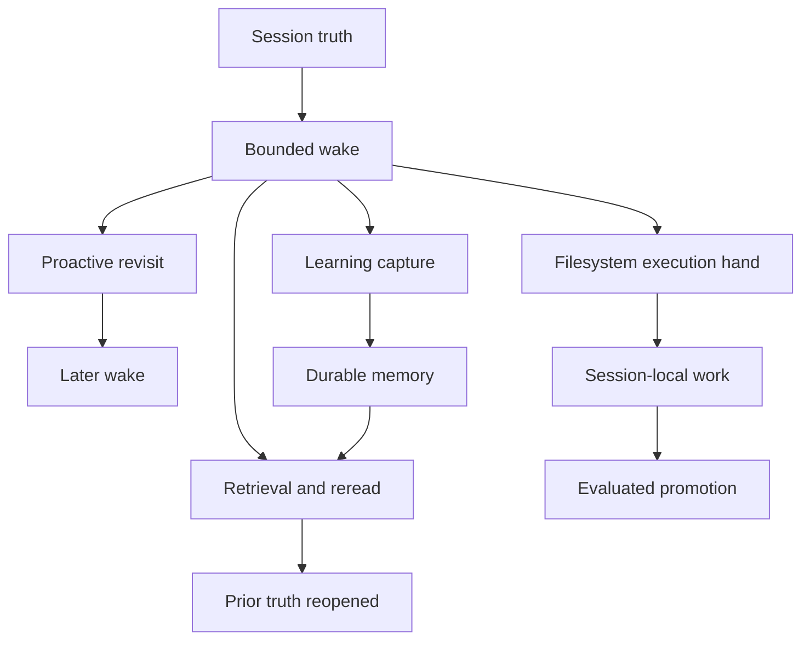
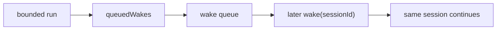
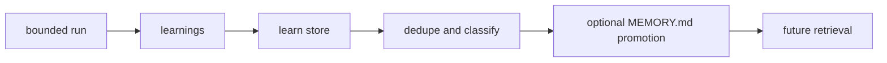
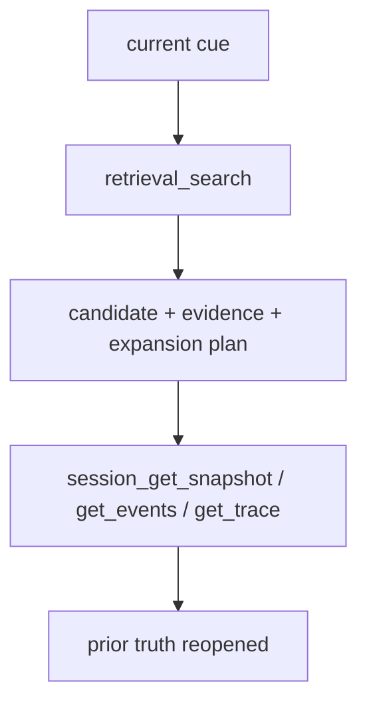
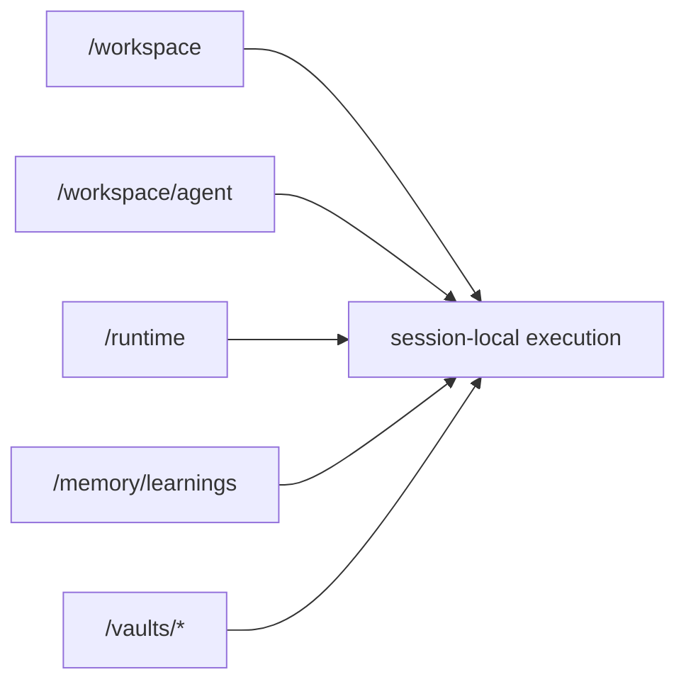
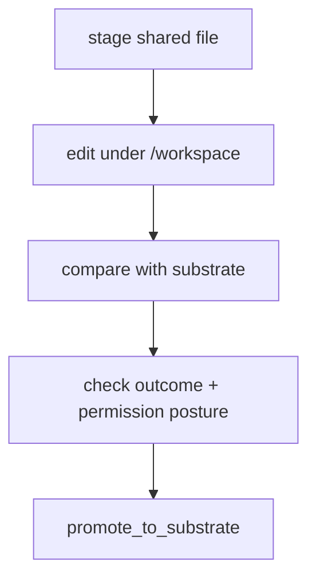
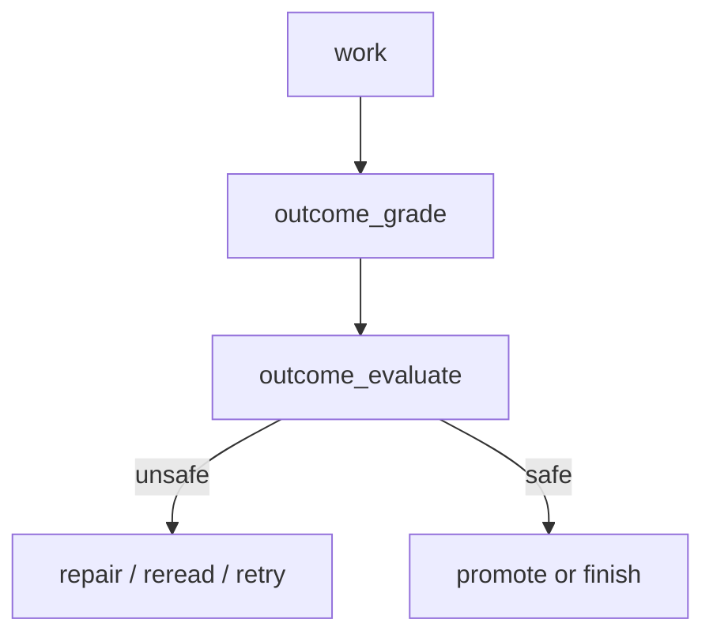

This page explains the core capabilities of the openboa `Agent`.

Use [Agent](../agent.md) for the high-level meaning of the layer.
Use [Agent Runtime](../agent-runtime.md) for the operational contract.
Use this page when you want to understand what the Agent can do, why those capabilities exist, and which runtime seam owns each one.

## Why capabilities matter

The Agent layer should not be understood as a pile of tools.

It is better understood as one runtime with a small number of durable capabilities:

- keep work alive across wakes
- act again without being re-prompted from scratch
- learn from prior runs
- reopen prior truth instead of trusting one summary
- work through a filesystem-native execution hand
- improve durable shared substrate without letting one run corrupt it

Each of those capabilities exists because long-running agents break when any one of them is missing.

## Capability map

Read the diagram this way:

- the session is the durable object
- one wake is a bounded run over that session
- the run may schedule another wake, capture learnings, use the execution hand, and reopen prior truth
- durable improvement is not implicit; it must pass through evaluation and promotion

## 1. Session-first truth

The first capability is not glamorous, but it is the one the rest depend on.

The Agent can keep truth outside the model context window because the durable object is the `Session`, not the prompt.

This exists so the runtime can:

- survive long horizons
- survive context pressure
- survive provider swaps
- survive rereads and repair loops

Without this capability, every other feature collapses into prompt compaction or one-shot state passing.

Owned by:

- `Session`
- `SessionEvent`
- `Harness` context assembly

Read next:

- [Agent Runtime](../agent-runtime.md)
- [Agent Sessions](./sessions.md)

## 2. Proactive continuation

`Proactive` means the Agent can decide that one bounded run is not enough and request a later revisit.

It does not mean hidden unlimited autonomy.
It means:

- a run emits `queuedWakes`
- the runtime stores them durably
- orchestration later consumes the due activation and wakes the same session again

This capability exists because many real tasks are not solvable in one uninterrupted burst.

Owned by:

- loop directive
- `Harness`
- wake queue
- orchestration
- event-driven worker loop

Not owned by:

- a `proactive.*` tool family

That is intentional. Proactive continuation is session-control behavior, not a generic callable side-effect surface.

## 3. Learning

`Learning` means the Agent can turn runtime experience into durable reusable lessons.

It does not mean dumping transcripts into memory.
It means:

- a run emits `lesson`, `correction`, or `error`
- the runtime deduplicates and stores those learnings
- selected learnings can be promoted into shared `MEMORY.md`

This capability exists because session-local scratch state is not enough for durable improvement.

Owned by:

- loop directive
- `Harness`
- learn store
- managed memory promotion tools

Not owned by:

- a `learning.*` action model

The capture happens in the harness.
Inspection and promotion happen through existing memory tools.

## 4. Retrieval and reread

The Agent can recall prior work without pretending one compact summary is enough.

The runtime uses:

- cheap deterministic candidate retrieval
- bounded reread of prior session truth

This capability exists because:

- future turns need different facts than present turns
- irreversible compaction decisions are unsafe as the only memory model
- the Agent needs cross-session reuse without flattening everything into one prompt

Owned by:

- retrieval pipeline
- session navigation tools
- memory tools

## 5. Filesystem-native execution

The Agent can work through a mounted execution hand instead of only through prompt text.

The runtime deliberately separates:

- `/workspace`
  - session-local writable execution hand
- `/workspace/agent`
  - shared agent substrate
- `/runtime`
  - runtime artifacts
- `/memory/learnings`
  - durable learnings surface
- `/vaults/*`
  - protected mounts

This capability exists because real agents need a working surface that behaves like an environment, not only like a chat transcript.

Owned by:

- `Environment`
- `ResourceAttachment`
- `Sandbox`
- shell and filesystem tools

## 6. Safe shared improvement

The Agent can improve durable shared state, but not by mutating shared substrate arbitrarily.

The runtime separates:

- session-local editing
- comparison against shared substrate
- evaluator and permission posture
- explicit promotion

This capability exists because the runtime needs self-improvement without letting one run directly overwrite durable shared steering.

Owned by:

- resources tools
- outcome tools
- permission posture

## 7. Outcome-evaluated improvement

The Agent can define an outcome, grade current posture, evaluate whether it is actually safe to land or promote, and repair if not.

This exists to prevent the runtime from confusing:

- feeling done
- being done

This capability is the quality gate for self-improvement.

Owned by:

- outcome tools
- harness self-guidance
- permission posture for gated tools

## Capability boundaries

These capabilities are implemented through existing runtime seams.

That matters because the Agent layer should stay coherent.

Use this rule:

- if the behavior is session truth
  - it belongs in `Session`
- if the behavior is one bounded run
  - it belongs in `Harness`
- if the behavior is execution hand
  - it belongs in `Sandbox`, `Environment`, or mounted `Resources`
- if the behavior is durable recall
  - it belongs in retrieval and memory surfaces
- if the behavior is durable improvement
  - it belongs in outcome, memory, and promotion surfaces

Do not turn every behavior into a new primitive or a new tool family.

## Reading order

After this page:

1. read [Agent Runtime](../agent-runtime.md) for the runtime contract
2. read [Agent Memory](./memory.md), [Agent Context](./context.md), and [Agent Resilience](./resilience.md) for the concrete runtime surfaces
3. read [Agent Architecture](./architecture.md) for the internal structure
4. read [Agent Bootstrap](./bootstrap.md) for durable steering files
5. read [Agent Tools](./tools.md) and [Agent Sandbox](./sandbox.md) for the callable execution surface
