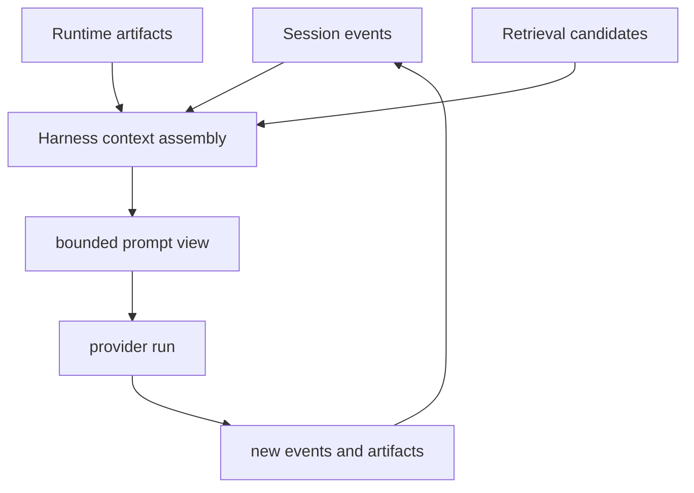

# Agent Context

This page explains context in the openboa `Agent` runtime.

Use this page when you want to answer:

- what the prompt contains
- what the prompt does not contain
- why the session is the truth instead of the context window
- what retrieval candidates mean
- what context pressure is for

## The core rule

The session is durable truth.

The prompt is a bounded view assembled for one wake.

That is the most important context rule in the runtime.

## Why this rule exists

Compacted summaries and prompt-local context are useful, but they are not good enough to be the only truth.

Future wakes may need:

- old user messages
- prior shell evidence
- earlier tool results
- the lead-up to a blocked action

If those are only preserved as one summary, the runtime becomes brittle.

## The context model

This means the prompt is assembled, used, and discarded.
The durable objects remain.

## What goes into prompt context

Typical prompt context includes:

- recent conversation continuity
- selected runtime notes
- active outcome posture
- current environment and resource posture
- retrieval candidates for prior truth

What matters is not that everything is loaded.
What matters is that the runtime can reopen what it needs.

## Retrieval candidates are not truth

Retrieval candidates are hints.

They exist to tell the model:

- which prior session may matter
- which memory source may matter
- which exact reread tool is the right next step

They should not be confused with canonical truth.

The canonical truth still lives in:

- session events
- runtime artifacts
- durable memory surfaces

## Reread versus trust

The Agent should prefer:

1. find a relevant candidate
2. reopen the underlying truth
3. act using the reopened evidence

instead of trusting one compacted summary forever.

That is why retrieval and `session_get_events` style reread exist.

## Context pressure

The runtime also tracks context pressure.

Context pressure answers questions like:

- how much recent history fit into this wake
- how much was dropped
- whether protected continuity had to be preserved
- whether the model should prefer reread instead of broad continuation

## Current behavior under pressure

When pressure is high, the runtime can bias the Agent toward:

- `session_describe_context`
- retrieval and reread
- read-first inspection
- narrower next steps

instead of broad, assumption-heavy continuation.

## Design rule

Do not treat context engineering and truth storage as the same problem.

In openboa:

- truth storage belongs to sessions and durable artifacts
- context engineering belongs to the harness

That separation keeps the runtime flexible as models change.

## Related reading

- [Agent Runtime](../agent-runtime.md)
- [Agent Resilience](./resilience.md)
- [Agent Harness](./harness.md)
- [Agent Sessions](./sessions.md)
- [Agent Memory](./memory.md)
- [Agent Tools](./tools.md)
