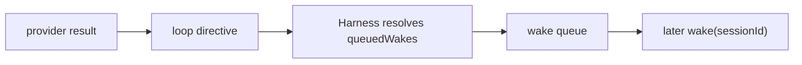
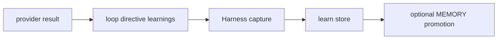

# Agent Harness


The harness is the bounded execution loop for one session run.

It is the closest thing to the “brain loop,” but it is still not the whole runtime.

Use this page when you want to answer:

- what one bounded run actually does
- where provider output becomes durable runtime progress
- why proactive continuation and learning capture belong here
- what stays outside the harness

## What the harness does

For one bounded run, the harness:

1. loads the session
2. reads pending session events
3. loads the environment and attached resources
4. loads session runtime memory
5. assembles context
6. calls the provider backend
7. interprets the loop directive
8. appends new session events
9. updates session state and runtime memory

That is why the harness sits between:

- orchestration
- provider runner
- sandbox and tool execution
- session storage

## What the harness does not do

The harness does not own:

- public scheduling APIs
- application-specific routing
- external publication semantics
- broader domain truth outside the session model
- reusable environment definitions

Those live outside the bounded run loop.

## Relationship to orchestration

The public orchestration seam is:

```ts
wake(sessionId)
```

Orchestration decides:

- should this session be run now
- should a bounded revisit be queued

The harness decides:

- what this run means
- which events to append
- whether the session should sleep, reschedule, or pause for action

## Proactive behavior lives here

The harness is where bounded proactive continuation becomes real runtime behavior.

The provider does not directly schedule timers.
Instead, the provider emits a loop directive, and the harness interprets that directive into durable queued wakes.

That means the proactive loop is:

1. provider suggests `queuedWakes`
2. harness validates and resolves them
3. wake scheduling is written durably
4. orchestration later consumes the due wake
5. the same session runs again



This matters because proactive behavior is not a hidden background trick.
It is a harness-mediated continuation seam that stays visible in the session runtime model.

## Relationship to providers

Provider backends such as Codex or Claude are swappable brains behind the harness seam.

That means:

- provider-specific runners are implementation details
- the harness is the stable runtime contract
- the session model should survive brain swaps

## Loop directive

The current harness expects the provider response to resolve into:

- plain-text response
- durable summary
- sleep or continue
- optional queued wakes
- optional learnings
- optional custom tool pause

That is how the harness turns a raw model response into durable runtime progress.

Two of those fields deserve explicit interpretation:

- `queuedWakes`
  - proactive continuation
- `learnings`
  - runtime improvement

They are both emitted by the loop directive, but they do different jobs.

## Custom tool pause

The harness can pause a session for a custom tool result.

That path works like this:

1. the agent requests a custom tool
2. the harness emits `agent.custom_tool_use`
3. the session moves to `requires_action`
4. the runtime waits for `user.custom_tool_result`
5. the next wake resumes the same session

This is intentionally smaller than a full approval UX.

## Runtime memory

The harness writes session-local continuity into:

- `checkpoint.json`
- `session-state.md`
- `working-buffer.md`

It also writes reusable learnings into the agent-level learning store.

That means:

- scratch state stays local to the session
- reusable lessons survive across sessions

## Learning capture lives here

The harness is also where runtime experience becomes durable learning.

The learning loop is:

1. provider emits `learnings`
2. harness normalizes and deduplicates them
3. learnings are written into the agent-level learn store
4. selected learnings may be promoted into shared `MEMORY.md`



This is why learning does not belong only in prompt text.
The harness turns it into durable runtime state.

## Design rule

If a change is about:

- context assembly
- interpreting pending events
- turning one provider result into durable session progress

it likely belongs in the harness.

If it is about:

- public session APIs
- wake scheduling policy
- external routing or publication semantics

it likely belongs outside the harness.

## Related reading

- [Agent Runtime](../agent-runtime.md)
- [Agent Sessions](./sessions.md)
- [Agent Sandbox](./sandbox.md)
- [Agent Tools](./tools.md)
