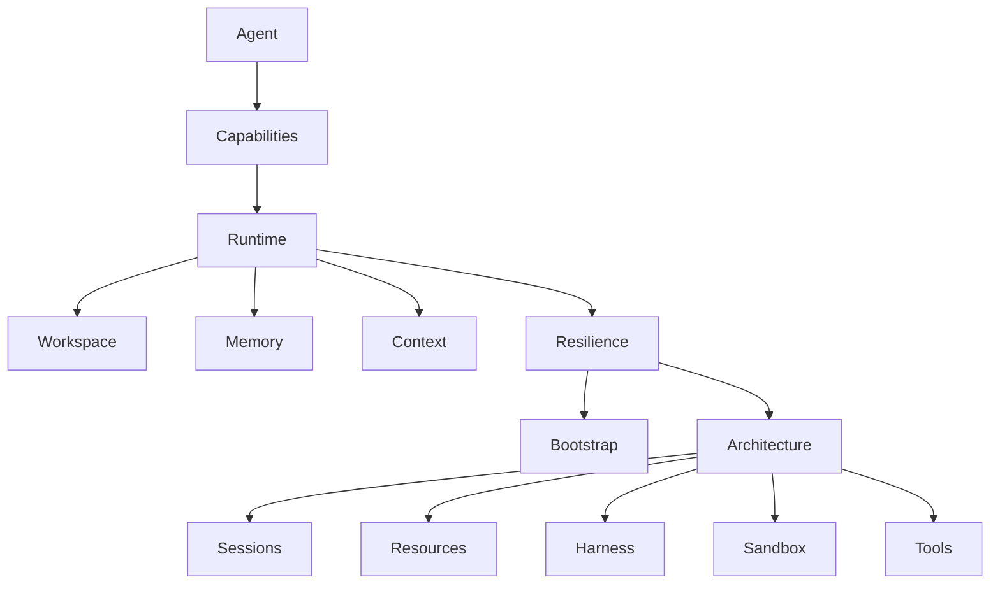

# Agent Hub

This is the entry page for the `Agent` docs.

Use it when you want to understand the Agent layer itself and need a clear reading order.

The Agent docs are designed around one rule:

- explain meaning first
- then capabilities
- then runtime contract
- then the concrete runtime surfaces
- then internal architecture
- then detailed reference pages

If those layers are mixed, the runtime becomes harder to learn and harder to maintain.

## Start here

Read these first:

1. [Agent](../agent.md)
   - what the layer is and why it exists
2. [Agent Capabilities](./capabilities.md)
   - what the runtime can actually do
3. [Agent Runtime](../agent-runtime.md)
   - how one wake runs and what gets persisted
4. [Agent Workspace](./workspace.md)
   - where the Agent actually works
5. [Agent Memory](./memory.md)
   - what counts as durable memory versus session-local state
6. [Agent Context](./context.md)
   - why the session is the truth and the prompt is only a bounded view
7. [Agent Resilience](./resilience.md)
   - how the runtime pauses, retries, requeues, and resumes

That sequence should answer the basic questions:

- what is an openboa Agent
- why is it session-first
- what are `proactive` and `learning`
- what lives in prompt versus files versus session truth
- where the Agent actually works
- how memory differs from context
- how resilience differs from durability

## Then read the durable steering and structure pages

After the first seven pages:

1. [Agent Bootstrap](./bootstrap.md)
   - durable steering files and system prompt assembly
2. [Agent Architecture](./architecture.md)
   - internal structure, mounts, retrieval, promotion, code map

Those pages answer:

- where `AGENTS.md`, `SOUL.md`, and `MEMORY.md` come from
- why bootstrap is file-backed
- where runtime artifacts live
- why shared substrate and session execution hand are separate

## Then use the references

The reference pages are for targeted questions after the core mental model is already clear.

- [Agent Sessions](./sessions.md)
- [Agent Environments](./environments.md)
- [Agent Resources](./resources.md)
- [Agent Harness](./harness.md)
- [Agent Sandbox](./sandbox.md)
- [Agent Tools](./tools.md)

Use them when you need to answer a precise question such as:

- what statuses and stop reasons exist
- what is mounted where
- how the harness interprets the loop directive
- which tools are managed and which are gated
- how the sandbox boundary works

## Concept map

Read the map this way:

- `Agent` explains the meaning of the layer
- `Capabilities` explains what the layer can do
- `Runtime` explains how it operates
- `Workspace`, `Memory`, `Context`, and `Resilience` explain the concrete runtime surfaces
- `Bootstrap` and `Architecture` explain how it is built
- the remaining pages are references

## What each page is for

### [Agent](../agent.md)

Use when the question is:

- what is the Agent layer
- why does it exist
- what belongs inside it and outside it

### [Agent Capabilities](./capabilities.md)

Use when the question is:

- what does the Agent runtime actually do
- why are `proactive` and `learning` different
- why does retrieval exist
- why is execution filesystem-native

### [Agent Runtime](../agent-runtime.md)

Use when the question is:

- how does a wake run
- what is durable
- what is prompt-local
- how do proactive revisits, learning, retrieval, and promotion fit together

### [Agent Workspace](./workspace.md)

Use when the question is:

- where does the Agent actually work
- what is writable in one session
- what is shared across sessions
- what is `.openboa-runtime`

### [Agent Memory](./memory.md)

Use when the question is:

- what counts as memory
- what is only runtime state
- what gets auto-loaded
- what gets searched and reread

### [Agent Context](./context.md)

Use when the question is:

- what goes into the prompt
- why the session is the truth
- what retrieval candidates mean
- what context pressure is for

### [Agent Resilience](./resilience.md)

Use when the question is:

- how the runtime survives interruption
- what pause, retry, requeue, and replay mean
- what resilience guarantees exist today
- where to inspect activation recovery behavior

### [Agent Bootstrap](./bootstrap.md)

Use when the question is:

- where do `AGENTS.md`, `SOUL.md`, and `MEMORY.md` come from
- why are they files
- how do they enter the system prompt

### [Agent Architecture](./architecture.md)

Use when the question is:

- how is the runtime internally structured
- what are the main code seams
- how do mounts, retrieval, and promotion work together

## Reading advice

If you only read one page, read [Agent](../agent.md).

If you are building or debugging the runtime, read:

1. [Agent](../agent.md)
2. [Agent Capabilities](./capabilities.md)
3. [Agent Runtime](../agent-runtime.md)
4. [Agent Workspace](./workspace.md)
5. [Agent Memory](./memory.md)
6. [Agent Context](./context.md)
7. [Agent Resilience](./resilience.md)
8. [Agent Architecture](./architecture.md)

If you are editing steering files, also read:

1. [Agent Bootstrap](./bootstrap.md)

If you are changing execution or tools, then use:

- [Agent Sandbox](./sandbox.md)
- [Agent Tools](./tools.md)
- [Agent Resources](./resources.md)

## Design rule for the docs

The Agent docs should never force the reader to learn the runtime in reverse.

That means:

- concept pages should not read like raw reference pages
- runtime pages should not be overloaded with every tool detail
- architecture pages should explain why the structure exists, not only list files
- reference pages should answer precise questions without redefining the whole system
