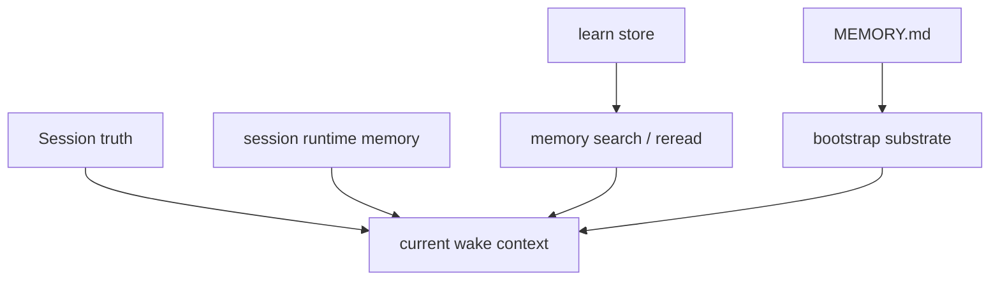
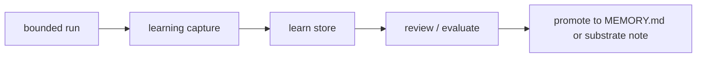

# Agent Memory

This page explains memory in the openboa `Agent` runtime.

Use this page when you want to answer:

- what counts as Agent memory
- what is only session-local state
- what gets auto-loaded versus searched
- how learning becomes durable memory
- why memory is not the same thing as the prompt

## Why memory needs its own page

Long-running agents fail when all state is flattened into one bucket.

In practice, openboa has multiple memory surfaces:

- durable shared memory for the Agent
- current-session runtime state
- learned lessons
- prompt-local context for one wake

Those surfaces serve different purposes and should not be confused.

## The memory model

The key distinction is:

- some memory is loaded as durable steering
- some memory is searched and reread
- some state is only for the current session

## Shared Agent memory

Shared Agent memory lives in the durable substrate.

The main public surface is:

- `MEMORY.md`

This file belongs to the Agent itself, not to one session.

It is appropriate for:

- durable lessons worth reusing
- stable reminders that should survive across wakes
- guidance that is still Agent-specific rather than product-global

It is not appropriate for:

- temporary scratch state
- one-turn shell output
- per-session open loops

## Learned lessons

The runtime also keeps structured learned lessons.

These are captured from bounded runs as:

- lessons
- corrections
- errors

They live in the learn store and can later be:

- searched directly
- promoted into shared memory when they become durable enough

This is why `learning` is not the same as `MEMORY.md`.

Learning is the capture loop.
`MEMORY.md` is one durable destination for promoted knowledge.

## Session runtime memory

Some state belongs only to the current session.

Examples:

- checkpoint
- session state
- working buffer
- shell state
- current outcome posture

This state is useful, but it is not shared durable memory.

It exists so the session can resume and inspect itself.

## What is auto-loaded

The runtime auto-loads durable steering from the shared substrate.

That includes:

- bootstrap files
- `MEMORY.md`

The runtime does **not** auto-load every prior session artifact into the prompt.

Instead, it uses:

- retrieval candidates
- memory search
- session reread

That design keeps the prompt bounded and makes prior truth reopenable.

## What is searched instead of loaded

These surfaces are primarily searched and reread:

- learn store entries
- workspace memory notes
- prior session runtime memory
- prior session summaries and traces

## Promotion path

The promotion rule is simple:

- capture first
- reuse and verify
- promote only when it becomes durable enough

## Design rule

Do not solve every memory problem by making the prompt bigger.

Prefer this order:

1. durable session truth
2. runtime artifacts for current continuity
3. retrieval and reread for prior truth
4. explicit promotion into shared memory only when justified

## Related reading

- [Agent](../agent.md)
- [Agent Capabilities](./capabilities.md)
- [Agent Runtime](../agent-runtime.md)
- [Agent Resilience](./resilience.md)
- [Agent Bootstrap](./bootstrap.md)
- [Agent Sessions](./sessions.md)
- [Agent Tools](./tools.md)
