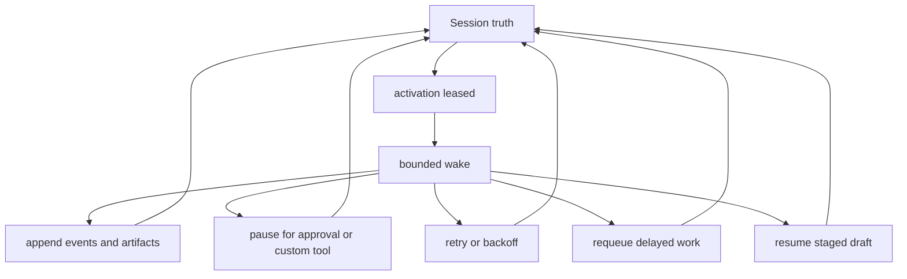

# Agent Resilience

This page explains resilience in the openboa `Agent` runtime.

Use this page when you want to answer:

- what resilience means in the runtime
- why durability alone is not enough
- how pause, retry, requeue, and recovery fit together
- what the runtime guarantees during failure and resume
- where to inspect resilience behavior as an operator

## Why resilience needs its own page

`Memory` explains what stays durable.
`Context` explains what one wake can currently see.

Neither one fully explains what happens when execution is interrupted.

Long-running agents need a third explanation surface:

- what happens when a run pauses for approval
- what happens when a custom tool result is still pending
- what happens when a wake times out or loses its lease
- what happens when delayed work must be replayed
- what happens when staged work should be resumed instead of restarted

That is the resilience surface.

## The core rule

The runtime should resume from durable truth instead of depending on one uninterrupted run.

That is the shortest useful definition of resilience in openboa.

## The resilience model

Read the diagram this way:

- the durable object is still the session
- a wake may succeed, pause, fail, retry, or schedule more work
- each path writes back into durable truth instead of disappearing into transient process state

## What resilience means here

In openboa, resilience is not a vague promise that the worker is “robust.”

It specifically means the runtime can:

- pause cleanly and wait for confirmation or custom tool input
- retry with explicit backoff instead of hot-looping
- requeue delayed work without losing wake intent
- recover from stale or lost leases
- preserve staged substrate drafts across interrupted work
- expose the activation lifecycle so an operator can inspect what happened

## Durable truth versus resilient execution

`Durable` and `resilient` are related, but they are not the same thing.

- durable truth
  - the session log, runtime artifacts, shared substrate, and learned memory remain inspectable
- resilient execution
  - the runtime can pause, retry, replay, and resume from that durable truth

You need both.

If truth is durable but execution is not resilient, the runtime keeps records but still behaves like a one-shot worker.
If execution retries but truth is not durable, recovery becomes guesswork.

## The main resilience seams

### Approval pauses

If a managed tool requires confirmation:

- the session stops with `requires_action`
- the pending request is stored durably
- a later `user.tool_confirmation` resumes the same session

That means confirmation is not hidden UI state.

### Custom tool pauses

If the model requests a custom tool result:

- the session stops with `requires_action`
- the request id, tool name, and tool input are stored durably
- a later `user.custom_tool_result` resumes the same session

### Retry and backoff

Retryable failures should not immediately hot-loop.

Instead, the runtime:

- preserves the pending session truth
- marks the session as runnable again
- defers execution with explicit backoff
- exposes retry posture through status surfaces

### Delayed wake replay

If a queued wake was consumed but the run failed before completing cleanly:

- the wake intent should not disappear
- the delayed work should be replay-safe

That is why consumed queued wakes are restored on failure paths.

### Staged draft resume

Shared substrate edits do not happen in-place.

The runtime stages a draft into session workspace first.
If execution is interrupted, that staged draft remains inspectable and resumable instead of forcing the agent to start from scratch.

## Activation lifecycle

The runtime treats execution as an activation flow, not just as “call model and hope it works.”

The main lifecycle is:

1. activation becomes ready
2. worker leases activation
3. one bounded wake runs
4. activation is:
   - `acked`
   - `requeued`
   - `blocked`
   - `abandoned`

This lifecycle is durable and inspectable.

## Operator visibility

Resilience is not complete if only the runtime knows what happened.

The operator should be able to inspect:

- current retry posture
- pending approval or custom tool input
- queued wake backlog
- active lease owner
- latest activation outcome
- activation claim history
- staged draft status

Current surfaces include:

- `openboa agent session status`
- `openboa agent session events`
- `openboa agent activation-events`
- `openboa agent orchestrator --watch --log`

## What the runtime guarantees

Today the Agent runtime is designed to guarantee:

- session truth is durable across wakes
- approval and custom tool pauses are resumable
- retryable failures back off instead of hot-looping immediately
- delayed wake intent is replay-safe on failure paths
- staged substrate drafts can survive interruption and be resumed
- activation lifecycle is inspectable through journaled events

## What it does not guarantee

This page should also be explicit about current limits.

The runtime does not yet guarantee:

- broker-backed distributed queue semantics
- unlimited autonomous background execution without a worker surface
- provider-independent proof across multiple live providers
- automatic recovery from every possible external side effect

Those belong to future frontiers, not hidden assumptions.

## Design rule

Do not describe resilience as a vague property of the model.

In openboa, resilience belongs to the runtime contract:

- durable session truth
- explicit activation lifecycle
- replay-safe recovery
- visible operator seams

That is why resilience belongs next to memory and context as a first-class Agent page.

## Related reading

- [Agent](../agent.md)
- [Agent Runtime](../agent-runtime.md)
- [Agent Memory](./memory.md)
- [Agent Context](./context.md)
- [Agent Sessions](./sessions.md)
- [Agent Harness](./harness.md)
