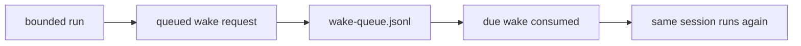

# Agent Sessions


`Session` is the primary runtime object in the current Agent layer.

If you remember only one thing, remember this:

- the agent definition is durable
- the environment is reusable
- the session is what actually runs

Use this page when you want to answer:

- what a session really owns
- what wake semantics mean
- what remains isolated per session
- what can be shared across many sessions for the same Agent

## What a session owns

A session owns:

- one `sessionId`
- one `agentId`
- one `environmentId`
- one append-only event stream
- one isolated runtime memory directory
- one attached resource list
- one stop reason and status
- optional `parentSessionId` metadata when it is a delegated child session

It does **not** own:

- broader domain truth outside the session model
- other sessions for the same agent

## Status model

The current status model is:

- `idle`
- `running`
- `rescheduling`
- `terminated`

The corresponding stop reasons are:

- `idle`
- `requires_action`
- `rescheduling`
- `terminated`

`requires_action` is how the runtime pauses for custom tool results without inventing a separate approval system in the Agent core.
It now also covers managed tool confirmation requests for `always_ask` tools.

## Event model

Each session has an append-only `events.jsonl`.

Current event families:

- `user.message`
- `user.define_outcome`
- `user.interrupt`
- `user.tool_confirmation`
- `user.custom_tool_result`
- `session.status_changed`
- `session.status_idle`
- `span.started`
- `span.completed`
- `agent.message`
- `agent.tool_use`
- `agent.custom_tool_use`

Pending means:

- `processedAt == null`

`user.interrupt` is the redirect seam.
When it arrives before the next wake, the runtime clears blocked confirmation/custom-tool state and drops queued revisits before continuing the bounded run.

This is the reason `wake(sessionId)` can stay small.
Orchestration does not need to carry the whole prompt payload because the session already contains the unprocessed work.

The current runtime also treats the session as an interrogable context object.
That means the harness can:

- reread recent processed history
- rewind around a specific anchor event
- query only selected event families
- reopen other sessions for the same agent through managed tools

The session is durable storage.
The model context window is only a bounded view assembled from it.

## Storage layout

Each session lives here:

```text
.openboa/agents/<agent-id>/sessions/<session-id>/
  session.json
  events.jsonl
  runtime/
    checkpoint.json
    session-state.md
    working-buffer.md
  wake-queue.jsonl
```

Meaning:

- `session.json`
  - canonical durable state
- `events.jsonl`
  - append-only event journal
- `runtime/`
  - local continuity for the harness
- `wake-queue.jsonl`
  - internal revisit scheduling

## Session isolation

Multiple sessions can exist for the same agent.

That is important because:

- one agent may have many distinct threads of work
- context isolation matters
- one bad thread should not contaminate another
- learnings can be shared at the agent level without sharing runtime scratch state

What is isolated per session:

- event history
- runtime memory
- pending custom-tool request
- pending tool-confirmation request
- wake queue
- child-session execution context

What is shared across sessions for the same agent:

- workspace substrate
- agent definition
- agent-level learnings
- vault references

The current bounded multi-agent seam keeps that isolation explicit:

- `session_delegate`
  - creates a direct child session
- `session_list_children`
  - enumerates direct children for a parent session
- `session_run_child`
  - advances one direct child for a few bounded cycles

This keeps subproblems as separate session logs rather than merging them into one oversized parent thread.
The runtime also mirrors those relations into each session hand under `.openboa-runtime/session-relations.json`.

## Event ingress and wake semantics

The public ingress surface is the session event log.

That means external callers should:

1. append a `user.message`, `user.interrupt`, `user.tool_confirmation`, or `user.custom_tool_result`
2. let orchestration consume that pending work

`wake(sessionId)` is still public, but it is the low-level execution seam, not the primary registration surface.

The execution seam is:

```ts
wake(sessionId) -> void
```

Operationally, that means:

1. load the session
2. read pending events
3. if nothing is pending and no revisit is due, do nothing
4. otherwise run one bounded harness cycle

This is intentionally weaker than “run with this payload”.

That weakness is a feature.
It keeps orchestration decoupled from:

- provider-specific logic
- application-specific routing semantics
- exact context assembly rules

## Proactive revisits

Sessions are not only passive containers for incoming work.

The current runtime also lets a session request its own later revisit through queued wakes.

That means:

- one bounded run can ask for another bounded run later
- revisit scheduling is stored durably in `wake-queue.jsonl`
- the same session remains the truth-bearing object across those revisits



This is what makes the runtime proactive in a bounded way.

In practical operation, that usually means:

- new session events act like immediate activations
- queued wakes act like delayed activations
- a worker loop consumes both without changing the session-first model

It does **not** mean:

- a hidden background process invents new state outside the session
- a second secret coordination system exists outside the event log

It means the session can explicitly schedule its own next revisit inside the same durable runtime model.

## Learning versus session state

Sessions also produce experience, but that experience should not all remain as session-local scratch state.

The runtime distinguishes:

- session-local continuity
  - checkpoint, session-state, working-buffer
- agent-level learning
  - lesson, correction, error capture
- shared memory promotion
  - selected durable learnings promoted into `MEMORY.md`

That split matters because:

- session-local continuity should stay thread-specific
- learnings should be reusable across sessions
- promoted memory should remain curated instead of becoming a transcript dump

## CLI

Create a session:

```bash
pnpm openboa agent session create --name alpha
```

Send a message into a session:

```bash
pnpm openboa agent session send --session <uuid-v7> --message "Summarize your state."
```

Confirm a managed tool request:

```bash
pnpm openboa agent session confirm-tool --session <uuid-v7> --allowed true
```

Inspect it:

```bash
pnpm openboa agent session status --session <uuid-v7>
pnpm openboa agent session events --session <uuid-v7> --limit 10
```

Wake it:

```bash
pnpm openboa agent wake --session <uuid-v7>
```

Inside the runtime, the same navigation shape is available through managed tools like:

- `environment_describe`
- `vault_list`
- `permissions_describe`
- `session_list`
- `session_list_children`
- `session_get_snapshot`
- `session_get_events`
- `session_get_trace`
- `session_run_child`
- `memory_list`
- `outcome_read`
- `outcome_define`

That means the session carries not only event history, but also a durable active outcome that can be read or updated without inventing a second coordination system outside the session log.
The runtime memory surface now also exposes attached store descriptors such as `checkpoint`, `shell_state`, `session_state`, and `working_buffer`, so the model can discover durable session memory without guessing fixed filenames.
Session events now also carry an optional `wakeId`, which lets the runtime reread one bounded harness run as a trace instead of only as positional slices.
`session_get_trace` now returns the full wake-bounded trace by default unless the caller explicitly applies a limit.
Wake traces also carry `span.started` and `span.completed` records for wake-level and tool-level execution.
If a bounded run fails unexpectedly, the runtime now still closes the wake trace with `span.completed result=error` and records a failure-flavored `session.status_idle` summary instead of leaving the session stuck in `running`.

## Design rule

Any new Agent feature should answer this first:

**Does this belong on the session, or does it belong above the Agent layer?**

If it is:

- transient runtime continuity
- pending execution work
- bounded tool pause/resume
- per-thread execution history

it probably belongs on the session.

If it is:

- broader coordination across many sessions
- external publication or delivery semantics
- governance or observation across many sessions

it probably belongs above the session runtime.

## Related reading

- [Agent Runtime](../agent-runtime.md)
- [Agent Environments](./environments.md)
- [Agent Resources](./resources.md)
- [Agent Harness](./harness.md)
