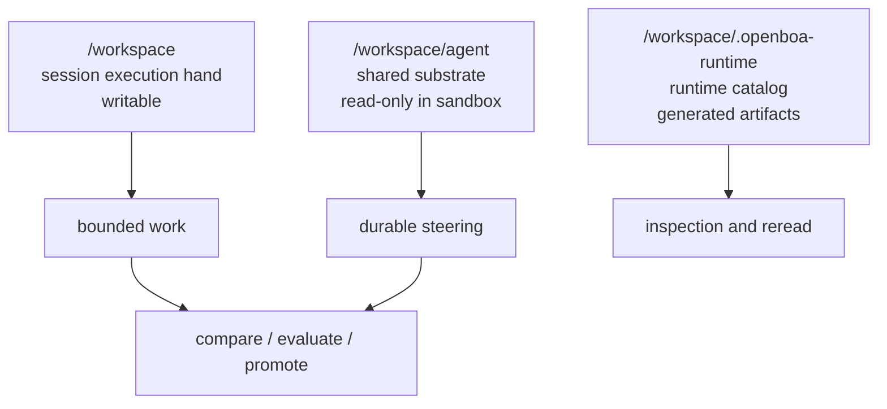
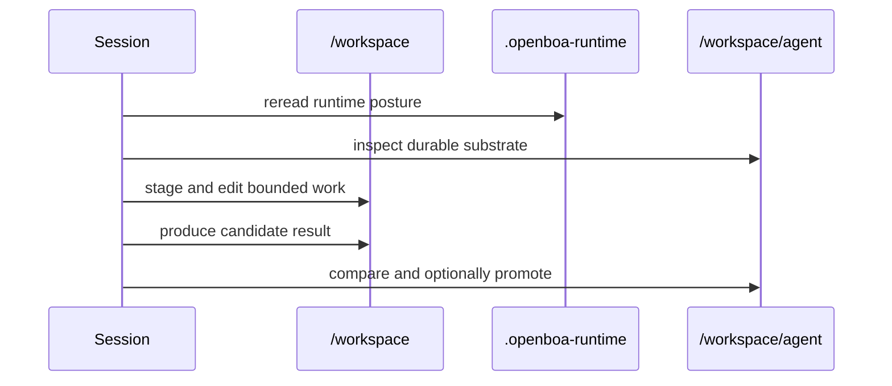

# Agent Workspace


This page explains the filesystem surface of an openboa `Agent`.

Use this page when you want to answer:

- where the Agent actually works
- what is writable in one session
- what is shared across sessions
- what lives in `.openboa-runtime`
- why `/workspace` and `/workspace/agent` are different

## Why this page exists

The Agent runtime is intentionally filesystem-native.

That only becomes understandable once three different surfaces are separated:

- the session execution hand
- the shared Agent substrate
- the runtime catalog

If those are mixed together, the runtime feels arbitrary and the promotion model becomes hard to understand.

## The three workspace surfaces



Read this diagram literally:

- `/workspace`
  - where the current session edits and runs
- `/workspace/agent`
  - where shared bootstrap and durable Agent memory live
- `/workspace/.openboa-runtime`
  - where the runtime materializes current state so the Agent can reread it from files

## `/workspace`: the session execution hand

`/workspace` is the writable hand for one session.

This is where the Agent should:

- stage shared files before editing them
- create temporary working files
- run bounded shell commands
- inspect and revise current-session outputs

The key rule is:

- prefer doing current work here
- do not treat it as global durable truth

That keeps one session productive without letting it silently mutate shared state.

## `/workspace/agent`: the shared substrate

`/workspace/agent` is the durable shared substrate for one Agent identity.

It contains:

- bootstrap steering files such as `AGENTS.md`, `SOUL.md`, and `TOOLS.md`
- durable Agent memory such as `MEMORY.md`
- any other shared, reusable Agent-level substrate

Inside the normal sandbox hand, this mount is intentionally read-only.

That is not because the Agent should be weak.
It is because shared mutation must be explicit.

The write path is:

1. stage into `/workspace`
2. compare with substrate
3. evaluate if needed
4. promote back into `/workspace/agent`

## `.openboa-runtime`: the runtime catalog

The runtime also materializes a catalog under:

```text
/workspace/.openboa-runtime/
```

These files exist so the Agent does not need to rely only on prompt-local state.

Typical artifacts include:

- environment posture
- resource catalog
- tool contract
- outcome and outcome grade
- context budget
- event feed
- wake traces
- shell last output
- permission posture

This means the Agent can inspect the current session as files as well as through tools.

## Why the split matters

This split preserves four properties at once:

1. the Agent can work like it has a real filesystem
2. one session can stay productive without waiting on global mutation
3. shared durable steering stays protected
4. runtime observability survives outside the prompt

## Typical flow



## What this page is not

This page is not the full resource API reference.

Use:

- [Agent Resources](./resources.md)
  - for resource kinds, access rules, and writeback semantics
- [Agent Bootstrap](./bootstrap.md)
  - for the meaning of the shared steering files
- [Agent Sandbox](./sandbox.md)
  - for the execution hand and shell surface

## Related reading

- [Agent Runtime](../agent-runtime.md)
- [Agent Bootstrap](./bootstrap.md)
- [Agent Resources](./resources.md)
- [Agent Sandbox](./sandbox.md)
