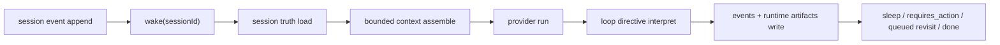
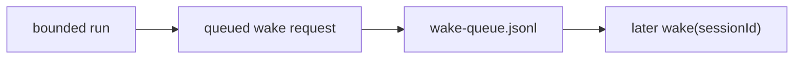
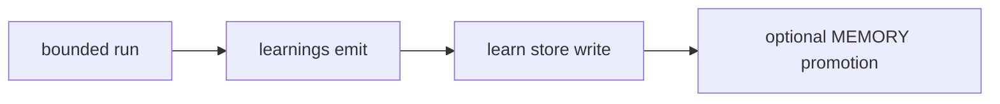

# 에이전트 런타임


이 페이지는 openboa `Agent` 런타임이 실제로 어떻게 동작하는지 설명하는 canonical 문서입니다.

[에이전트](./agent.md)가 레이어의 의미를 설명한다면, 이 페이지는 런타임 contract를 설명합니다.
[에이전트 리질리언스](./agents/resilience.md)는 pause, retry, requeue, replay 같은 recovery behavior를 설명합니다.

## 한 문장으로 요약한 런타임 계약

openboa Agent 런타임은 다음과 같은 session-first 시스템입니다.

- durable `Session`이 실제 실행 객체다
- `wake(sessionId)`가 그 세션에 대해 한 번의 bounded `Harness` loop를 실행한다
- 그 run은 mounted resource, tool, retrieval, shell, outcome posture를 사용한다
- 그리고 결과를 같은 session의 이벤트와 runtime artifact로 다시 기록한다

## One-wake flow



가장 중요한 포인트는 두 가지입니다.

- prompt는 disposable하다
- session은 durable하다

## 핵심 런타임 객체

현재 public runtime 모델의 핵심 객체는 다음과 같습니다.

- `Agent`
  - reusable worker runtime identity
- `Environment`
  - reusable execution substrate
- `Session`
  - 실제 running object
- `SessionEvent`
  - append-only truth
- `ResourceAttachment`
  - mounted durable input
- `Harness`
  - one-wake bounded run loop
- `Sandbox`
  - execution boundary
- `ToolDefinition`
  - stable callable contract

## Prompt view와 truth의 차이

런타임에서 진실은 prompt 안에 있지 않습니다.

진실은 다음에 있습니다.

- session event log
- session runtime artifact
- shared substrate
- durable memory surface

prompt는 그 durable truth에서 이번 wake에 필요한 일부를 조립한 bounded view일 뿐입니다.

이 분리가 중요한 이유는:

- long-running session은 context window를 초과한다
- compacted summary는 useful하지만 reversible truth는 아니다
- future wake는 old event나 exact shell evidence를 다시 읽어야 할 수 있다

## 상태와 stop model

현재 status는 다음 네 가지입니다.

- `idle`
- `running`
- `rescheduling`
- `terminated`

현재 stop reason은 다음 네 가지입니다.

- `idle`
- `requires_action`
- `rescheduling`
- `terminated`

`requires_action`은 custom tool result나 managed tool confirmation처럼 외부 입력이 더 필요할 때 session을 pause시키는 seam입니다.

## 기본 저장 구조

세션은 기본적으로 다음 경로에 저장됩니다.

```text
.openboa/agents/<agent-id>/sessions/<session-id>/
  session.json
  events.jsonl
  runtime/
    checkpoint.json
    session-state.md
    working-buffer.md
  wake-queue.jsonl
```

즉:

- `session.json`
  - canonical durable state
- `events.jsonl`
  - append-only event journal
- `runtime/`
  - 현재 세션 continuity
- `wake-queue.jsonl`
  - internal revisit scheduling

## Runtime artifact

런타임은 prompt 밖에서도 상태를 다시 읽을 수 있도록 artifact를 materialize합니다.

대표적인 artifact는 다음과 같습니다.

- outcome
- outcome grade / evaluation
- context budget
- event feed
- wake traces
- shell state / history / last output
- permission posture
- environment / resource catalog

이 artifact는 `.openboa-runtime/` 아래에서 Agent가 file처럼 다시 읽을 수 있습니다.

## Mount model

기본 mount 모델은 다음 세 층으로 나뉩니다.

- `/workspace`
  - session execution hand
- `/workspace/agent`
  - shared substrate
- `/workspace/.openboa-runtime`
  - runtime catalog

여기에 추가로:

- `/memory/learnings`
  - reusable learning surface
- `/vaults/*`
  - protected read-only mount

가 붙습니다.

## Proactive 실행

`proactive`는 “백그라운드에서 몰래 뭔가 하는 것”이 아닙니다.

현재 의미는 bounded revisit입니다.

흐름은 이렇습니다.

1. provider가 loop directive에서 `queuedWakes`를 제안한다
2. harness가 이를 검증하고 durable queue에 쓴다
3. orchestration이 due wake를 나중에 consume한다
4. 같은 session이 다시 `wake(sessionId)`로 실행된다



즉 proactive는 separate scheduler truth가 아니라 session runtime model 안의 explicit continuation입니다.

## Learning loop

`learning`은 session-local scratch state와 다릅니다.

현재 흐름은:

1. provider가 `learnings`를 emit한다
2. harness가 normalize하고 dedupe한다
3. learn store에 저장한다
4. durable enough하면 `MEMORY.md` 같은 shared memory로 promote할 수 있다



즉 learning은 capture loop이고, shared memory는 그중 일부의 durable destination입니다.

## Retrieval과 reread

openboa는 compacted context 하나를 계속 믿는 방식으로 long-running agent를 만들지 않습니다.

대신:

- current wake에서는 bounded context만 조립하고
- retrieval candidate로 prior truth를 찾고
- 필요하면 session event나 runtime artifact를 다시 연다

즉:

- session은 truth
- prompt는 view
- retrieval candidate는 hint
- reread가 실제 verification

## Outcome과 promotion loop

shared mutation과 durable promotion은 explicit하게 다뤄집니다.

핵심 원칙은:

- current session work는 `/workspace`에서 한다
- shared substrate mutation은 direct write가 아니다
- `compare -> evaluate -> promote` 경로를 탄다

이렇게 하면:

- session execution hand의 자유도는 유지되고
- shared durable substrate는 보호된다

## Common operating loop

가장 일반적인 운영 loop는 다음과 같습니다.

1. session에 event append
2. `wake(sessionId)`
3. harness가 bounded context assemble
4. provider run
5. new event / runtime artifact 기록
6. 필요하면 `sleep`, `requires_action`, `queued revisit`, `done`

이 loop는 작지만, long-running agent에 필요한 대부분의 seam을 담고 있습니다.

## 이 페이지가 다루지 않는 것

이 페이지는 다음을 전부 다루지는 않습니다.

- bootstrap file별 세부 의미
- full internal architecture
- exhaustive tool catalog

그건 아래 문서를 읽으면 됩니다.

- [에이전트 워크스페이스](./agents/workspace.md)
- [에이전트 메모리](./agents/memory.md)
- [에이전트 컨텍스트](./agents/context.md)
- [에이전트 리질리언스](./agents/resilience.md)
- [에이전트 부트스트랩](./agents/bootstrap.md)
- [에이전트 아키텍처](./agents/architecture.md)
- [에이전트 도구](./agents/tools.md)

## 다음 읽기 순서

계속 읽으려면:

1. [에이전트 기능](./agents/capabilities.md)
2. [에이전트 워크스페이스](./agents/workspace.md)
3. [에이전트 메모리](./agents/memory.md)
4. [에이전트 컨텍스트](./agents/context.md)
5. [에이전트 리질리언스](./agents/resilience.md)
6. [에이전트 아키텍처](./agents/architecture.md)
7. [에이전트 세션](./agents/sessions.md)
8. [에이전트 샌드박스](./agents/sandbox.md)
9. [에이전트 도구](./agents/tools.md)
