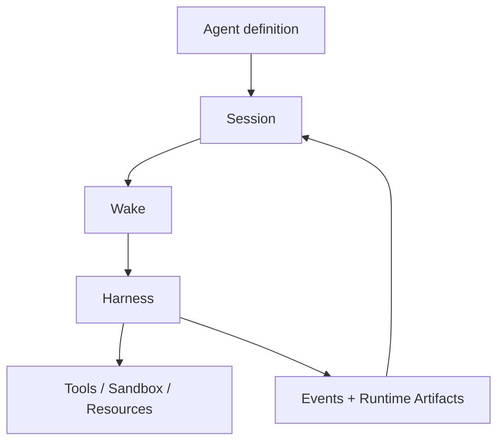

`Agent`는 openboa의 reusable worker runtime입니다.

이 레이어는 하나의 앱 표면이 아닙니다.
session을 유지하고, wake를 넘겨가며 일하고, filesystem-native execution hand를 사용하고, 안전하게 개선을 축적하는 durable runtime입니다.

이 페이지는 Agent 레이어의 의미를 설명합니다.
runtime detail이나 code structure로 내려가기 전에 먼저 읽어야 하는 페이지입니다.

## 왜 Agent 레이어가 필요한가

openboa는 worker behavior가 현재 존재하는 특정 product surface에 shape-locked되기를 원하지 않습니다.

어느 한 surface가 worker contract를 소유해버리면:

- runtime은 재사용이 어려워지고
- 시스템 경계를 설명하기 어려워지고
- 주변 surface가 바뀔 때 runtime 자체도 흔들리게 됩니다

그래서 Agent 레이어는 다음 reusable runtime contract를 보호하기 위해 존재합니다.

- durable session이 실제 running object다
- one wake는 그 session 위에서 도는 bounded run이다
- execution은 mounted resource와 tool을 통해 일어난다
- durable improvement는 explicit하게 다뤄진다

이 contract 덕분에 Agent는 주변 surface가 바뀌어도 유효한 runtime으로 남습니다.

## openboa Agent는 무엇인가

openboa Agent는 다음과 같은 성격을 가집니다.

- session-first
- long-running
- filesystem-native
- tool-using
- proactive revisit 가능
- durable learning 가능
- prompt-local summary만 믿지 않고 prior truth를 다시 열 수 있음

## 핵심 mental model

이 다이어그램은 Agent를 이렇게 이해하라는 뜻입니다.

- `Agent definition`
  - reusable identity와 durable steering
- `Session`
  - 실제로 running object가 되는 durable thread
- `Wake`
  - 한 번의 bounded run
- `Harness`
  - 한 wake를 해석하고 진행시키는 loop
- `Tools / Sandbox / Resources`
  - 실제 execution hand
- `Events + Runtime Artifacts`
  - prompt 밖에 남는 durable truth

## Agent 레이어가 주는 것

Agent 레이어는 다음 capability를 제공합니다.

- wake를 넘어 이어지는 session continuity
- current turn이 끝난 뒤에도 다시 실행될 수 있는 proactive continuation
- lesson, correction, error를 durable하게 축적하는 learning
- prior truth를 다시 여는 retrieval과 reread
- `/workspace`를 중심으로 하는 filesystem-native execution hand
- shared substrate를 direct mutation 없이 개선하는 safe promotion path

## 설계 논리

이 레이어는 “도구를 많이 붙인 모델”을 만들기 위해 존재하는 것이 아닙니다.

대신:

- worker를 durable runtime으로 만들고
- 현재 prompt를 truth로 착각하지 않게 하고
- execution을 concrete filesystem / shell surface 위에서 일어나게 하며
- 개선을 explicit하게 다루도록 만들기 위해 존재합니다

즉 Agent는 상위 제품을 위한 helper가 아니라, 그 위에 여러 surface가 올라갈 수 있는 runtime substrate입니다.

## 특히 중요한 두 capability pair

### `proactive`와 `learning`

- `proactive`
  - 스스로 다시 깨어나 이어서 움직이는 능력
- `learning`
  - 실행에서 얻은 교훈을 durable하게 축적하는 능력

둘은 다릅니다.

`proactive`는 continuation seam이고, `learning`은 improvement seam입니다.

### `memory`와 `context`

- `memory`
  - durable하게 남기는 것
- `context`
  - 한 wake를 위해 bounded하게 조립하는 것

이 둘을 섞으면 long-running runtime이 곧바로 brittle해집니다.

## Durable steering substrate

Agent는 code 안에만 존재하지 않습니다.

durable steering substrate도 가집니다.

대표적으로:

- `AGENTS.md`
- `SOUL.md`
- `TOOLS.md`
- `IDENTITY.md`
- `USER.md`
- `HEARTBEAT.md`
- `BOOTSTRAP.md`
- `MEMORY.md`

이 파일들은 shared substrate에 있고, system prompt assembly의 일부가 됩니다.

## Agent 레이어가 직접 소유하지 않는 것

Agent는 다음을 직접 소유하지 않습니다.

- broader domain truth
- product-specific routing semantics
- business commitment와 work state
- operator-facing governance meaning

즉 Agent는 reusable runtime이고, domain/product meaning은 다른 레이어가 붙입니다.

## 인접 레이어와의 경계

- `Chat`
  - shared conversation truth를 제공
- `Work`
  - agent execution을 commitment와 result로 승격
- `Observe`
  - execution을 operator-facing evidence로 설명

하지만 이 페이지의 중심은 어디까지나 Agent 자체입니다.

## 다음으로 읽을 문서

1. [에이전트 허브](./agents/index.md)
2. [에이전트 기능](./agents/capabilities.md)
3. [에이전트 런타임](./agent-runtime.md)
4. [에이전트 워크스페이스](./agents/workspace.md)
5. [에이전트 메모리](./agents/memory.md)
6. [에이전트 컨텍스트](./agents/context.md)
7. [에이전트 리질리언스](./agents/resilience.md)
8. [에이전트 부트스트랩](./agents/bootstrap.md)
9. [에이전트 아키텍처](./agents/architecture.md)
