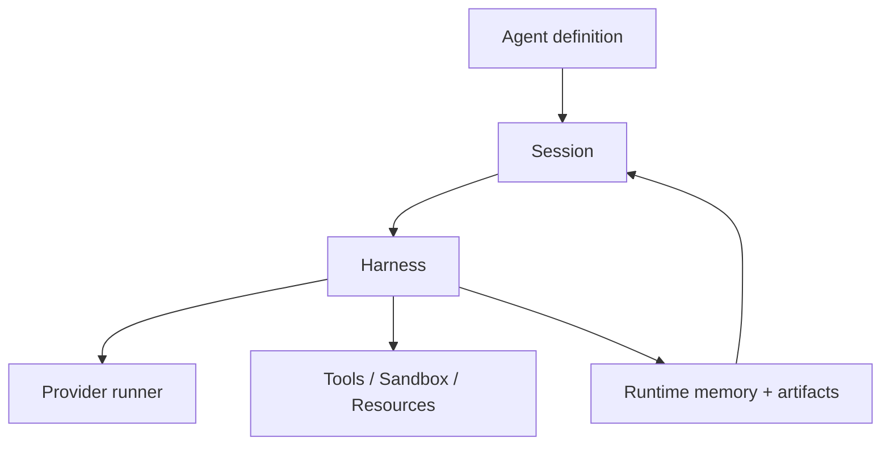
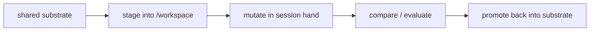

# 에이전트 아키텍처

이 페이지는 openboa `Agent` 런타임의 내부 구조를 설명합니다.

[에이전트](../agent.md)가 레이어의 의미를, [에이전트 런타임](../agent-runtime.md)이 public contract를 설명한다면, 이 페이지는 왜 코드와 구조가 이렇게 나뉘어 있는지 설명합니다.

## 설계 원칙

현재 아키텍처는 다음 원칙 위에 서 있습니다.

### 1. session truth는 durable하다

session log와 runtime artifact가 durable object입니다.
prompt는 그 위의 bounded projection입니다.

### 2. 한 번의 wake는 bounded해야 한다

한 run은 제한된 양의 일만 하고:

- 나중에 계속하거나
- action을 기다리거나
- reschedule하거나
- 종료해야 합니다

### 3. execution은 environment처럼 느껴져야 한다

Agent는 단순 prompt text가 아니라 mount, file, shell, runtime artifact를 통해 일해야 합니다.

### 4. shared mutation은 explicit해야 한다

여러 session에 걸쳐 durable하게 공유되는 것은 visible promotion path를 거쳐야 합니다.

### 5. retrieval은 truth를 다시 열어야 한다

cross-session reuse는 compacted summary를 맹신하기보다 prior truth를 다시 여는 쪽이어야 합니다.

## 레이어 맵

## Runtime surface

현재 public runtime surface를 이루는 것은:

- session
- environment
- resource attachment
- harness
- sandbox
- tool contract
- runtime artifact

입니다.

즉 Agent core는 상위 product surface 없이도 독립적으로 설명될 수 있어야 합니다.

## 저장 모델

실제 durable 저장은 대략 다음처럼 나뉩니다.

- `.openboa/agents/<agent-id>/workspace/`
  - shared substrate
- `.openboa/agents/<agent-id>/sessions/<session-id>/`
  - session truth와 runtime continuity
- `.openboa/agents/<agent-id>/learn/`
  - learn store
- `.openboa/environments/<environment-id>.json`
  - reusable environment definition

## Mount topology

실행 시점의 핵심 mount는 다음과 같습니다.

- `/workspace`
  - session execution hand
- `/workspace/agent`
  - shared substrate
- `/workspace/.openboa-runtime`
  - runtime catalog
- `/memory/learnings`
  - reusable learning surface
- `/vaults/*`
  - protected mount

## Context assembly

harness는:

- session event
- runtime artifact
- current environment/resource posture
- retrieval candidate

를 조립해 bounded context를 만듭니다.

즉 truth storage와 context engineering을 분리합니다.

## Promotion loop

공유되는 durable state는 explicit한 promotion loop를 탑니다.

## Retrieval loop

retrieval은 memory를 대신하는 것이 아니라 prior truth에 다시 닿게 하는 loop입니다.

1. candidate 생성
2. relevant source 선택
3. session event / runtime artifact / memory reread
4. reopened truth를 기반으로 실행

## Outcome과 improvement loop

self-improvement는 단순 capture가 아니라:

- learning capture
- outcome posture
- promotion safety

를 함께 봐야 합니다.

즉 improvement는 항상:

- local work
- evaluation
- selective promotion

형태를 유지해야 합니다.

## 코드 맵

현재 Agent subsystem의 주요 코드 seam은 다음과 같습니다.

- `src/agents/sessions/`
- `src/agents/runtime/`
- `src/agents/tools/`
- `src/agents/sandbox/`
- `src/agents/memory/`
- `src/agents/retrieval/`
- `src/agents/resources/`
- `src/agents/skills/`
- `src/agents/outcomes/`
- `src/agents/environment/`

## Agent core 바깥에 두는 것

다음은 Agent core 바깥에 둡니다.

- product-specific routing semantics
- broader domain truth
- external publication
- operator-facing governance meaning

즉 Agent는 reusable runtime이고, 주변 레이어가 product meaning을 붙입니다.

## 관련 문서

1. [에이전트 부트스트랩](./bootstrap.md)
2. [에이전트 세션](./sessions.md)
3. [에이전트 샌드박스](./sandbox.md)
4. [에이전트 도구](./tools.md)
