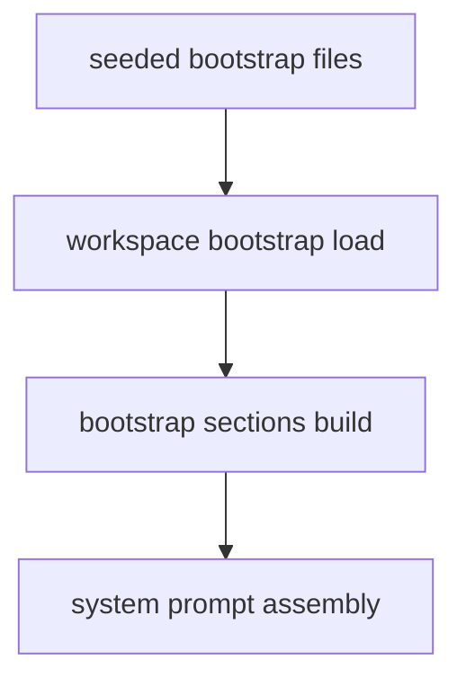

# 에이전트 부트스트랩


이 페이지는 openboa `Agent`의 bootstrap substrate를 설명합니다.

이 페이지가 답하는 질문은 다음과 같습니다.

- `AGENTS.md`, `SOUL.md`, `MEMORY.md`는 어디서 정의되는가
- 왜 이 파일들이 hard-coded prompt text가 아니라 file인가
- bootstrap file은 어떻게 system prompt에 들어가는가
- bootstrap과 runtime artifact는 왜 다른가

## openboa에서 bootstrap이 의미하는 것

Agent 주변에는 durable markdown이 두 종류 있습니다.

- bootstrap file
  - Agent 자체에 속하는 durable steering과 memory
- runtime artifact
  - 현재 session에 속하는 generated state

bootstrap file은 다음 질문에 답합니다.

- 이 Agent는 어떤 존재인가
- 어떤 stable posture를 유지해야 하는가
- 어떤 guidance가 session을 넘어 지속되어야 하는가

runtime artifact는 다음 질문에 답합니다.

- 지금 이 session에서 무엇이 일어나고 있는가
- 현재 shell state나 outcome posture는 어떤가

## bootstrap file은 어디서 정의되는가

bootstrap file set은 코드에서 정의되고, Agent setup 시점에 seed됩니다.

실제 정의 위치:

- [bootstrap-files.ts](../../../src/agents/workspace/bootstrap-files.ts)
- [setup.ts](../../../src/agents/setup.ts)
- [bootstrap.ts](../../../src/agents/environment/bootstrap.ts)

기본 위치는:

```text
.openboa/agents/<agentId>/workspace/
```

런타임 안에서는 shared substrate로 다음처럼 보입니다.

```text
/workspace/agent
```

## 현재 bootstrap file

현재 기본 file set은 다음과 같습니다.

- `AGENTS.md`
- `SOUL.md`
- `TOOLS.md`
- `IDENTITY.md`
- `USER.md`
- `HEARTBEAT.md`
- `BOOTSTRAP.md`
- `MEMORY.md`

## 왜 file 기반인가

이들이 파일인 이유는 단순합니다.

- inspectable해야 하고
- editable해야 하며
- shared substrate로 durable해야 하고
- prompt 밖에서도 Agent의 steering을 설명할 수 있어야 하기 때문입니다

즉 bootstrap은 “문자열을 붙여 만든 프롬프트 트릭”이 아니라, 실제 substrate입니다.

## Prompt assembly

부트스트랩은 system prompt assembly의 일부로 읽힙니다.



실제 순서는 대략 다음과 같습니다.

1. base prompt
2. agent-specific prompt
3. workspace bootstrap sections
4. runtime environment section
5. harness directive

즉 bootstrap file은 runtime-specific section이 아니라 durable steering section입니다.

## 파일별 역할

짧게 정리하면:

- `AGENTS.md`
  - Agent-level operating guidance
- `SOUL.md`
  - posture와 identity의 깊은 steering
- `TOOLS.md`
  - tool 사용 태도
- `IDENTITY.md`
  - Agent identity
- `USER.md`
  - user-specific durable guidance
- `HEARTBEAT.md`
  - revisit / follow-through posture
- `BOOTSTRAP.md`
  - bootstrap-specific steering
- `MEMORY.md`
  - promoted durable memory

## `MEMORY.md`가 bootstrap에 속하는 이유

`MEMORY.md`는 current session artifact가 아니라 Agent 자체의 durable memory surface입니다.

그래서 runtime artifact가 아니라 bootstrap substrate에 속합니다.

즉:

- current session continuity는 runtime artifact
- reusable lesson은 shared memory

입니다.

## bootstrap과 runtime artifact의 차이

이 차이는 중요합니다.

- bootstrap
  - Agent-level
  - durable steering
  - shared across sessions
- runtime artifact
  - session-level
  - current state
  - generated and updated during runs

## 안전한 수정 모델

shared bootstrap은 direct mutation 대상이 아닙니다.

수정 경로는:

1. `/workspace/agent`의 파일을 `/workspace`로 stage
2. current substrate와 compare
3. 필요하면 evaluate
4. shared substrate로 promote

즉 current session의 자유도와 shared steering의 안전성을 동시에 유지합니다.

## 관련 문서

- [에이전트 워크스페이스](./workspace.md)
- [에이전트 메모리](./memory.md)
- [에이전트 런타임](../agent-runtime.md)
- [에이전트 아키텍처](./architecture.md)
