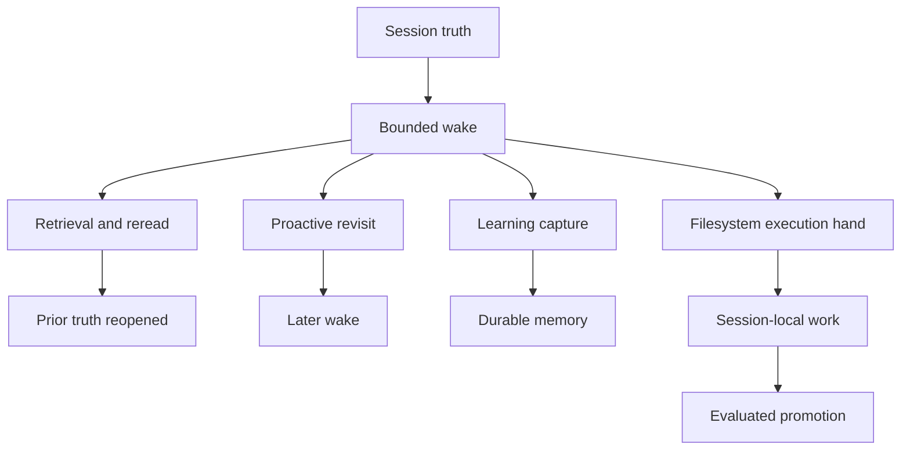

# 에이전트 기능

이 페이지는 openboa `Agent`의 핵심 capability를 설명합니다.

[에이전트](../agent.md)가 의미를 설명하고, [에이전트 런타임](../agent-runtime.md)이 contract를 설명한다면, 이 페이지는 “왜 이런 기능이 필요한가”를 capability 단위로 설명합니다.

## 왜 capability 기준으로 봐야 하는가

Agent는 tool의 모음으로 이해하는 것보다, 몇 가지 durable capability를 가진 runtime으로 이해하는 편이 훨씬 정확합니다.

현재 핵심 capability는 다음과 같습니다.

- session-first truth
- proactive continuation
- learning
- retrieval과 reread
- filesystem-native execution
- safe shared improvement
- outcome-evaluated improvement

## Capability map

## 1. Session-first truth

가장 중요한 capability는 session-first truth입니다.

이 말은:

- session이 실제 durable object이고
- prompt는 매 wake마다 조립되는 bounded view이며
- long-running continuity는 prompt가 아니라 session에 기대야 한다

는 뜻입니다.

이 capability가 없으면 agent는 context window에 종속되고, long-horizon work에서 쉽게 무너집니다.

## 2. Proactive continuation

`proactive`는 “스스로 계속 이어서 움직이는 능력”입니다.

현재 구현의 의미는 bounded revisit입니다.

- 현재 run이 나중의 revisit를 스스로 요청할 수 있고
- 그 요청은 durable wake queue에 기록되며
- 같은 session이 다시 실행됩니다

즉 proactive는 prompt 속 환상이 아니라 runtime model의 일부입니다.

## 3. Learning

`learning`은 실행 경험을 durable하게 축적하는 능력입니다.

중요한 구분은:

- 모든 session state가 learning은 아니다
- learning은 capture loop이고
- shared memory는 그 결과물 중 일부다

즉:

- checkpoint는 continuity
- learning은 reusable lesson

입니다.

## 4. Retrieval과 reread

이 capability는 “과거를 요약문 하나로 끝내지 않는다”는 뜻입니다.

현재 Agent는:

- retrieval candidate를 만들고
- prior session이나 durable memory를 찾고
- 필요하면 underlying truth를 다시 엽니다

따라서 retrieval은 memory를 대신하는 것이 아니라, prior truth에 다시 닿기 위한 navigation seam입니다.

## 5. Filesystem-native execution

Agent는 파일시스템, mount, shell, runtime artifact를 통해 일해야 합니다.

왜냐하면:

- 실제 작업은 파일과 명령 위에서 일어나고
- prompt만으로는 execution hand가 concrete하지 않으며
- inspectability도 떨어지기 때문입니다

그래서 openboa는:

- `/workspace`
- `/workspace/agent`
- `.openboa-runtime`
- bounded shell / file actions

을 runtime surface로 둡니다.

## 6. Safe shared improvement

session 안에서 자유롭게 일하는 것과 shared durable substrate를 바꾸는 것은 같은 문제가 아닙니다.

이 capability는:

- current session은 `/workspace`에서 자유롭게 일하고
- shared substrate는 direct mutation 없이
- explicit promotion path를 통해서만 바뀌게 합니다

이로써 self-improvement와 shared safety를 동시에 유지합니다.

## 7. Outcome-evaluated improvement

Agent는 “잘 끝났다고 느끼는 것”과 “실제로 충분한 품질인지”를 분리해야 합니다.

그래서 improvement는:

- 그냥 capture하고 끝내지 않고
- 필요하면 outcome/evaluation posture를 보고
- promotion 전에 더 보수적으로 판단합니다

이 capability는 self-improvement를 self-delusion으로 만들지 않기 위해 필요합니다.

## Capability 경계

이 capability들은 같은 것이 아닙니다.

- `proactive`
  - 다시 깨어나는 능력
- `learning`
  - 배운 것을 축적하는 능력
- `retrieval`
  - 과거 truth를 다시 여는 능력
- `filesystem execution`
  - 실제로 concrete하게 일하는 능력

문서에서 이들을 따로 설명하는 이유가 여기 있습니다.

## 다음으로 읽을 문서

1. [에이전트 런타임](../agent-runtime.md)
2. [에이전트 워크스페이스](./workspace.md)
3. [에이전트 메모리](./memory.md)
4. [에이전트 컨텍스트](./context.md)
5. [에이전트 리질리언스](./resilience.md)
6. [에이전트 아키텍처](./architecture.md)
