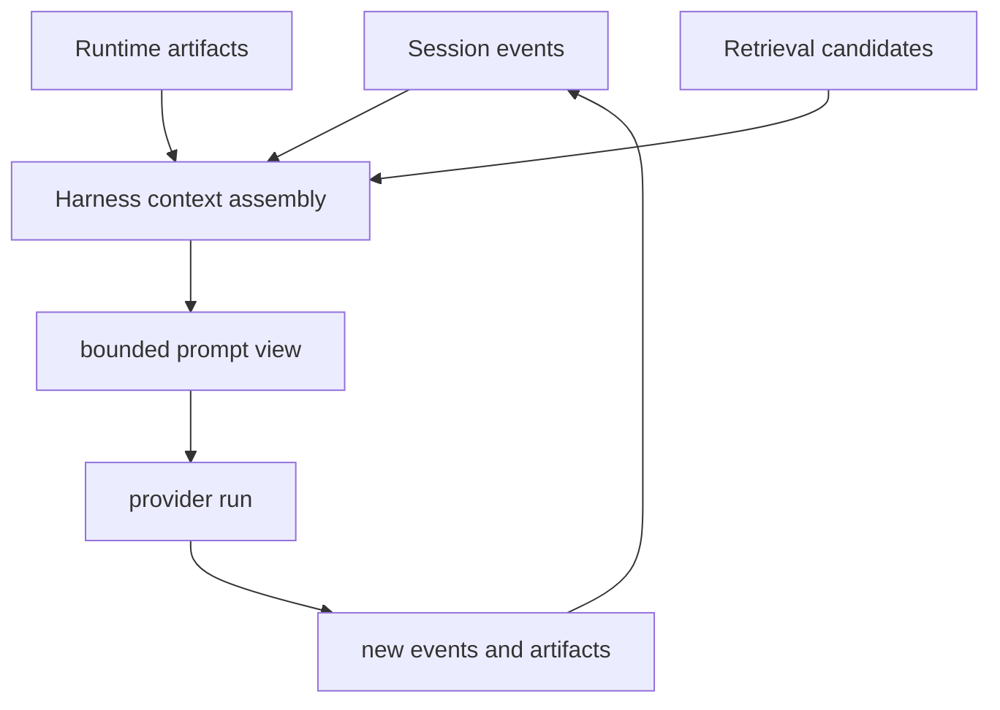

이 페이지는 openboa `Agent`의 context model을 설명합니다.

이 페이지가 답하는 질문은 다음과 같습니다.

- prompt에는 무엇이 들어가는가
- prompt에 들어가지 않는 것은 무엇인가
- 왜 session이 context window보다 더 중요하다고 말하는가
- retrieval candidate는 무엇인가
- context pressure는 무엇을 위한 신호인가

## 핵심 규칙

session이 durable truth입니다.

prompt는 한 번의 wake를 위해 조립된 bounded view일 뿐입니다.

이것이 openboa context model의 가장 중요한 규칙입니다.

## 왜 이런 규칙이 필요한가

compacted summary와 prompt-local context는 useful하지만, 그것만으로 long-running agent를 유지할 수는 없습니다.

미래의 wake는 종종 다시 필요로 합니다.

- 예전 user message
- prior shell evidence
- 이전 tool result
- blocked action 직전의 lead-up

만약 이런 것들이 summary 하나로만 남아 있다면 런타임은 brittle해집니다.

## Context model

즉 prompt는 assemble되고, 사용되고, 버려집니다.
durable object는 session과 artifact 쪽에 남습니다.

## Prompt에 들어가는 것

현재 prompt context에는 보통 다음이 들어갑니다.

- recent conversation continuity
- selected runtime note
- active outcome posture
- current environment / resource posture
- prior truth로 이어지는 retrieval candidate

중요한 것은 “모든 걸 넣는다”가 아니라, “필요한 truth를 다시 열 수 있다”입니다.

## Retrieval candidate는 truth가 아니다

retrieval candidate는 hint입니다.

그 목적은:

- 어느 prior session이 relevant한지
- 어느 memory source가 relevant한지
- 어떤 reread tool을 다음에 써야 하는지

를 알려주는 것입니다.

canonical truth는 여전히:

- session event
- runtime artifact
- durable memory surface

에 있습니다.

## Reread versus trust

Agent는 기본적으로 이 순서를 선호해야 합니다.

1. relevant candidate를 찾는다
2. underlying truth를 다시 연다
3. reopened evidence를 보고 행동한다

즉 compacted summary 하나를 forever trust하는 방식보다, prior truth를 다시 여는 방식을 택합니다.

그래서 `retrieval_search`, `memory_search`, `session_get_events`, `session_get_trace` 같은 seam이 존재합니다.

## Context pressure

런타임은 context pressure도 따로 추적합니다.

context pressure는 다음을 알려줍니다.

- 이번 wake에 얼마만큼의 history가 fit되었는가
- 무엇이 dropped되었는가
- protected continuity를 지켜야 했는가
- broad continuation보다 reread가 더 적절한가

이건 단순 observability가 아니라, Agent의 다음 행동을 바꾸는 신호입니다.

## Pressure가 높을 때의 행동

pressure가 높으면 런타임은 Agent를 다음 쪽으로 bias할 수 있습니다.

- `session_describe_context`
- retrieval과 reread
- read-first inspection
- narrower next step

즉 context가 crowded할 때는 무작정 계속 이어가기보다, 먼저 다시 읽고 좁히는 쪽으로 유도합니다.

## 설계 원칙

context engineering과 truth storage를 같은 문제로 취급하지 마십시오.

openboa에서는:

- truth storage는 session과 durable artifact가 담당하고
- context engineering은 harness가 담당합니다

이 separation 덕분에 모델이 바뀌어도 runtime contract는 덜 흔들립니다.

## 관련 문서

- [에이전트 런타임](../agent-runtime.md)
- [에이전트 리질리언스](./resilience.md)
- [에이전트 하네스](./harness.md)
- [에이전트 세션](./sessions.md)
- [에이전트 메모리](./memory.md)
- [에이전트 도구](./tools.md)
