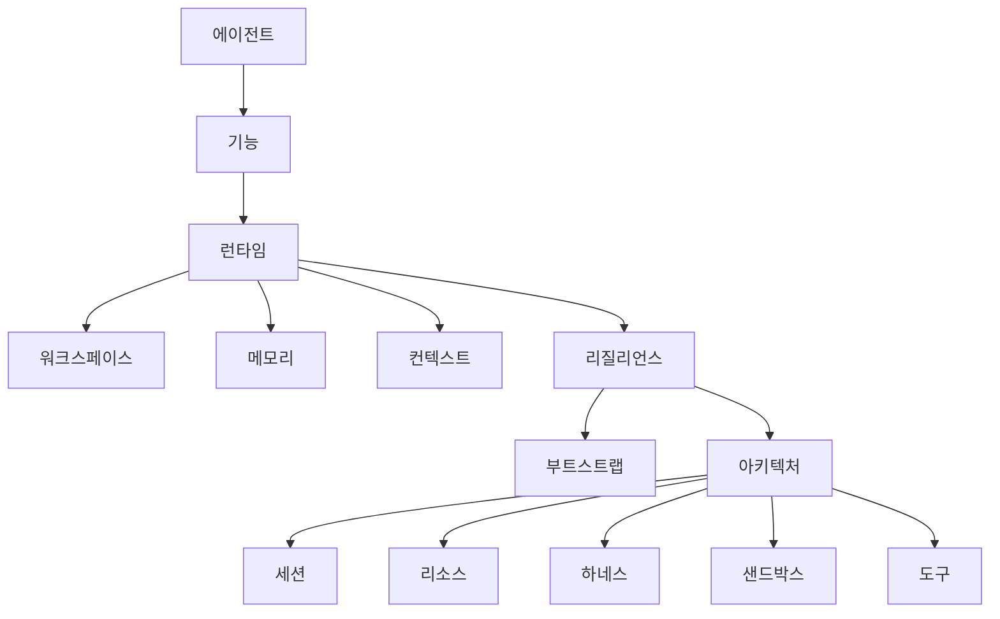

이 페이지는 openboa `Agent` 문서군의 진입점입니다.

에이전트 레이어 자체를 이해하고 싶을 때, 그리고 어떤 순서로 읽어야 전체 구조가 가장 잘 들어오는지 알고 싶을 때 이 페이지부터 읽으면 됩니다.

에이전트 문서는 다음 원칙으로 설계되어 있습니다.

- 먼저 의미를 설명한다
- 그 다음 capability를 설명한다
- 그 다음 runtime contract를 설명한다
- 그 다음 concrete runtime surface를 설명한다
- 마지막으로 내부 구조와 reference를 설명한다

이 순서가 깨지면 런타임을 거꾸로 배워야 하므로 문서가 갑자기 어려워집니다.

## 먼저 읽을 문서

다음 순서로 읽는 것을 권장합니다.

1. [에이전트](../agent.md)
   - Agent 레이어가 무엇인지, 왜 존재하는지
2. [에이전트 기능](./capabilities.md)
   - 이 런타임이 실제로 무엇을 할 수 있는지
3. [에이전트 런타임](../agent-runtime.md)
   - 한 번의 wake가 어떻게 실행되고 무엇이 durable하게 남는지
4. [에이전트 워크스페이스](./workspace.md)
   - Agent가 실제로 어디서 작업하는지
5. [에이전트 메모리](./memory.md)
   - durable memory와 session-local state가 어떻게 다른지
6. [에이전트 컨텍스트](./context.md)
   - 왜 session이 truth이고 prompt는 bounded view인지
7. [에이전트 리질리언스](./resilience.md)
   - 어떻게 pause, retry, requeue, resume가 되는지

이 일곱 페이지를 읽으면 다음 질문에 답할 수 있어야 합니다.

- openboa Agent는 무엇인가
- 왜 session-first인가
- `proactive`와 `learning`은 왜 다른가
- prompt, 파일, session truth는 각각 어디에 해당하는가
- Agent는 실제로 어디서 일하는가
- memory와 context는 왜 같은 것이 아닌가
- durability와 resilience는 왜 다른가

## 그 다음 읽을 구조 문서

위 일곱 페이지 다음에는 아래 구조 문서를 읽으면 됩니다.

1. [에이전트 부트스트랩](./bootstrap.md)
   - durable steering file과 system prompt assembly
2. [에이전트 아키텍처](./architecture.md)
   - 내부 구조, mount, retrieval, promotion, 코드 맵

## 마지막으로 reference를 사용

Reference 페이지는 targeted question이 생겼을 때 읽는 문서입니다.

- [에이전트 세션](./sessions.md)
- [에이전트 환경](./environments.md)
- [에이전트 리소스](./resources.md)
- [에이전트 하네스](./harness.md)
- [에이전트 샌드박스](./sandbox.md)
- [에이전트 도구](./tools.md)

## 개념 지도

이 다이어그램은 이렇게 읽으면 됩니다.

- `에이전트`
  - 레이어의 의미
- `기능`
  - 무엇을 할 수 있는지
- `런타임`
  - 어떻게 동작하는지
- `워크스페이스`, `메모리`, `컨텍스트`, `리질리언스`
  - 실제 runtime surface가 어떻게 나뉘는지
- `부트스트랩`, `아키텍처`
  - 왜 이런 구조로 만들어졌는지
- 나머지 문서
  - precise reference

## 빠른 읽기 가이드

하나만 읽어야 한다면 [에이전트](../agent.md)를 읽으세요.

런타임을 디버깅하거나 구현하고 있다면:

1. [에이전트](../agent.md)
2. [에이전트 기능](./capabilities.md)
3. [에이전트 런타임](../agent-runtime.md)
4. [에이전트 워크스페이스](./workspace.md)
5. [에이전트 메모리](./memory.md)
6. [에이전트 컨텍스트](./context.md)
7. [에이전트 리질리언스](./resilience.md)
8. [에이전트 아키텍처](./architecture.md)

durable steering file을 이해하거나 수정하고 있다면:

1. [에이전트 부트스트랩](./bootstrap.md)

execution hand나 tool surface를 다루고 있다면:

- [에이전트 샌드박스](./sandbox.md)
- [에이전트 도구](./tools.md)
- [에이전트 리소스](./resources.md)
