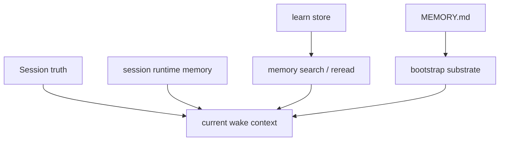
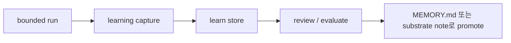

# 에이전트 메모리

이 페이지는 openboa `Agent`의 memory model을 설명합니다.

이 페이지가 답하는 질문은 다음과 같습니다.

- 무엇이 Agent memory인가
- 무엇은 단지 session-local state인가
- 무엇이 auto-load되고 무엇이 search 대상인가
- learning은 어떻게 durable memory가 되는가
- memory와 prompt는 왜 같은 것이 아닌가

## 왜 memory를 따로 설명해야 하는가

long-running agent는 모든 상태를 하나의 bucket으로 섞기 시작하는 순간 이해하기 어려워집니다.

openboa에는 서로 다른 목적의 memory surface가 있습니다.

- Agent-level durable shared memory
- current-session runtime state
- learned lessons
- one wake를 위한 prompt-local context

이들을 분리해서 설명하지 않으면 `learning`, `MEMORY.md`, `session-state`, `context`가 전부 같은 것으로 오해됩니다.

## Memory model

핵심은:

- 어떤 memory는 durable steering으로 로드되고
- 어떤 memory는 search와 reread를 통해 사용되며
- 어떤 state는 current session에만 속한다

는 점입니다.

## Shared Agent memory

shared Agent memory의 대표 surface는 `MEMORY.md`입니다.

이 파일은 한 session의 scratch가 아니라 Agent 자체에 속합니다.

적절한 내용은:

- 여러 session에 걸쳐 재사용할 durable lesson
- 장기적으로 유지해야 할 reminder
- product-global은 아니지만 Agent-specific하게 유지할 guidance

부적절한 내용은:

- temporary scratch
- one-turn shell output
- per-session open loop

## Learned lessons

런타임은 구조화된 learned lesson도 따로 유지합니다.

현재 유형은:

- lesson
- correction
- error

이들은 learn store에 저장되고, 이후:

- 직접 검색될 수 있고
- durable enough하면 shared memory로 promote될 수 있습니다

즉:

- learning은 capture loop이고
- `MEMORY.md`는 그중 일부가 도착하는 durable destination

입니다.

## Session runtime memory

어떤 state는 current session에만 속합니다.

대표적으로:

- checkpoint
- session state
- working buffer
- shell state
- current outcome posture

이 상태는 유용하지만 shared durable memory는 아닙니다.

그 목적은:

- session resume
- current continuity
- self-inspection

입니다.

## 무엇이 auto-load되는가

런타임은 shared substrate의 durable steering을 auto-load합니다.

예:

- bootstrap files
- `MEMORY.md`

하지만 이전 session의 모든 artifact를 prompt에 자동으로 다 넣지는 않습니다.

대신:

- retrieval candidate
- memory search
- session reread

를 통해 필요한 truth를 다시 엽니다.

## 무엇이 search 대상인가

주로 search와 reread 대상이 되는 것은:

- learn store entry
- workspace memory note
- prior session runtime memory
- prior session summary와 trace

입니다.

이 설계의 핵심은 prompt를 무한정 늘리지 않고도 prior truth에 다시 도달할 수 있게 하는 것입니다.

## Promotion path

promotion rule은 단순합니다.

- 먼저 capture한다
- 재사용과 검증을 거친다
- durable enough할 때만 shared memory로 승격한다

## 설계 원칙

memory 문제를 prompt 크기로 해결하려고 하지 마십시오.

우선순위는 다음과 같습니다.

1. durable session truth
2. current continuity를 위한 runtime artifact
3. prior truth를 다시 여는 retrieval / reread
4. justified한 경우에만 shared memory promotion

## 관련 문서

- [에이전트](../agent.md)
- [에이전트 기능](./capabilities.md)
- [에이전트 런타임](../agent-runtime.md)
- [에이전트 리질리언스](./resilience.md)
- [에이전트 부트스트랩](./bootstrap.md)
- [에이전트 세션](./sessions.md)
- [에이전트 도구](./tools.md)
