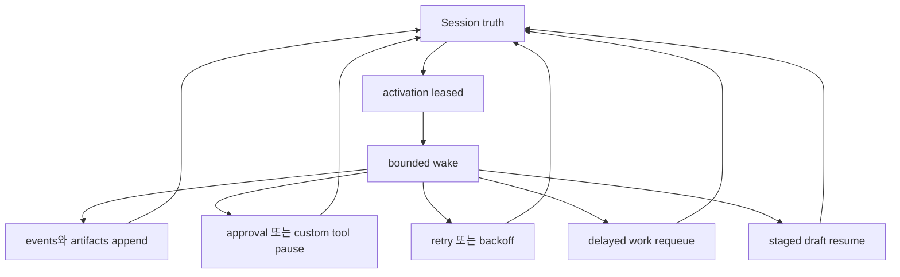

# 에이전트 리질리언스

이 페이지는 openboa `Agent` 런타임의 resilience를 설명합니다.

이 페이지가 답하는 질문은 다음과 같습니다.

- 런타임에서 resilience는 무엇을 뜻하는가
- durability만으로는 왜 충분하지 않은가
- pause, retry, requeue, recovery는 어떻게 연결되는가
- failure와 resume에서 런타임이 무엇을 보장하는가
- operator는 resilience 상태를 어디서 볼 수 있는가

## 왜 resilience를 따로 설명해야 하는가

`Memory`는 무엇이 durable하게 남는지 설명합니다.
`Context`는 한 번의 wake가 무엇을 볼 수 있는지 설명합니다.

하지만 둘만으로는 execution이 중간에 끊겼을 때 무슨 일이 일어나는지 충분히 설명할 수 없습니다.

long-running agent에는 세 번째 설명 축이 필요합니다.

- approval 때문에 멈추면 어떻게 되는가
- custom tool input이 아직 없으면 어떻게 되는가
- wake가 timeout 나거나 lease를 잃으면 어떻게 되는가
- delayed work는 어떻게 replay되는가
- staged work는 restart가 아니라 어떻게 resume되는가

그 설명 축이 `Resilience`입니다.

## 핵심 규칙

런타임은 한 번의 uninterrupted run에 기대지 않고, durable truth에서 다시 이어서 움직일 수 있어야 합니다.

이것이 openboa에서 말하는 resilience의 가장 짧은 정의입니다.

## Resilience model

이 다이어그램은 다음 뜻입니다.

- durable object는 여전히 session이다
- 한 wake는 성공할 수도 있고, pause될 수도 있고, 실패 후 retry될 수도 있다
- 어떤 경로든 transient process state에만 남지 않고 durable truth로 다시 기록된다

## 여기서 resilience가 뜻하는 것

openboa에서 resilience는 추상적인 “튼튼함”이 아닙니다.

구체적으로는 런타임이 다음을 할 수 있다는 뜻입니다.

- approval이나 custom tool input 때문에 clean하게 pause할 수 있다
- hot loop 대신 explicit backoff를 두고 retry할 수 있다
- delayed work를 잃지 않고 requeue할 수 있다
- stale lease나 lost lease에서 recover할 수 있다
- shared substrate draft를 interrupted work 이후에도 이어갈 수 있다
- activation lifecycle을 operator가 inspect할 수 있다

## Durable truth와 resilient execution

`Durable`과 `resilient`는 관련 있지만 같은 말은 아닙니다.

- durable truth
  - session log, runtime artifact, shared substrate, learned memory가 남는다
- resilient execution
  - 런타임이 그 durable truth를 바탕으로 pause, retry, replay, resume할 수 있다

둘 다 필요합니다.

truth만 durable하고 execution이 resilient하지 않으면 기록은 남지만 worker는 여전히 one-shot처럼 동작합니다.
execution만 retry되고 truth가 durable하지 않으면 recovery는 guesswork가 됩니다.

## 주요 resilience seam

### Approval pause

managed tool이 confirmation을 요구하면:

- session은 `requires_action`으로 멈추고
- pending request가 durable하게 저장되며
- 이후 `user.tool_confirmation`이 같은 session을 다시 이어줍니다

즉 confirmation은 hidden UI state가 아닙니다.

### Custom tool pause

model이 custom tool result를 요청하면:

- session은 `requires_action`으로 멈추고
- request id, tool name, tool input이 durable하게 저장되며
- 이후 `user.custom_tool_result`가 같은 session을 다시 이어줍니다

### Retry / backoff

retryable failure는 즉시 hot-loop로 다시 돌면 안 됩니다.

대신 런타임은:

- pending session truth를 보존하고
- session을 다시 runnable 상태로 두고
- explicit backoff를 걸고
- retry posture를 status surface에 노출합니다

### Delayed wake replay

queued wake를 consume한 뒤 run이 실패했다면:

- wake intent가 사라지면 안 되고
- delayed work는 replay-safe해야 합니다

그래서 failure path에서는 consumed queued wake를 restore합니다.

### Staged draft resume

shared substrate edit는 in-place로 일어나지 않습니다.

먼저 session workspace에 draft를 stage하고, execution이 중단되더라도 그 draft를 다시 inspect하고 resume할 수 있어야 합니다.

## Activation lifecycle

런타임은 execution을 단순히 “모델 한 번 호출”로 보지 않습니다.

현재 activation lifecycle은 다음과 같습니다.

1. activation이 ready 상태가 된다
2. worker가 activation을 lease한다
3. one bounded wake가 실행된다
4. activation은 다음 중 하나로 끝난다
   - `acked`
   - `requeued`
   - `blocked`
   - `abandoned`

이 lifecycle은 durable하고 inspectable합니다.

## Operator visibility

resilience는 런타임 내부에서만 알고 있으면 충분하지 않습니다.

operator는 다음을 볼 수 있어야 합니다.

- 현재 retry posture
- pending approval 또는 custom tool input
- queued wake backlog
- active lease owner
- latest activation outcome
- activation claim history
- staged draft status

현재 주요 surface는:

- `openboa agent session status`
- `openboa agent session events`
- `openboa agent activation-events`
- `openboa agent orchestrator --watch --log`

입니다.

## 런타임이 현재 보장하는 것

현재 Agent runtime은 다음을 보장하도록 설계되어 있습니다.

- session truth는 wake를 넘어 durable하다
- approval과 custom tool pause는 resumable하다
- retryable failure는 hot-loop 대신 backoff를 탄다
- delayed wake intent는 failure path에서도 replay-safe하다
- staged substrate draft는 interruption 뒤에도 resume 가능하다
- activation lifecycle은 journal을 통해 inspect 가능하다

## 아직 보장하지 않는 것

현재 한계도 같이 분명해야 합니다.

런타임은 아직 다음을 보장하지 않습니다.

- broker-backed distributed queue semantics
- worker surface 없이 무제한 background execution
- 여러 live provider에 대한 provider-independent proof
- 모든 외부 side effect에 대한 automatic recovery

이건 현재 frontier 밖의 과제입니다.

## 설계 원칙

resilience를 모델의 vague property처럼 설명하지 마십시오.

openboa에서 resilience는 runtime contract에 속합니다.

- durable session truth
- explicit activation lifecycle
- replay-safe recovery
- visible operator seam

그래서 `Resilience`는 `Memory`, `Context`와 나란한 독립 Agent 페이지가 되어야 합니다.

## 관련 문서

- [에이전트](../agent.md)
- [에이전트 런타임](../agent-runtime.md)
- [에이전트 메모리](./memory.md)
- [에이전트 컨텍스트](./context.md)
- [에이전트 세션](./sessions.md)
- [에이전트 하네스](./harness.md)
