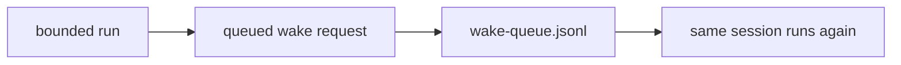

`Session`은 현재 Agent 레이어의 primary runtime object입니다.

기억해야 할 한 가지가 있다면 이것입니다.

- agent definition은 durable하다
- environment는 reusable하다
- 실제로 running object가 되는 것은 session이다

이 페이지는 다음 질문에 답합니다.

- session은 무엇을 소유하는가
- wake semantics는 무엇인가
- 무엇이 session마다 분리되는가
- 같은 Agent의 여러 session 사이에 무엇이 공유되는가

## Session이 소유하는 것

session은 다음을 소유합니다.

- `sessionId`
- `agentId`
- `environmentId`
- append-only event stream
- isolated runtime memory directory
- attached resource list
- stop reason과 status
- delegated child session일 때의 `parentSessionId`

반대로 session이 소유하지 않는 것은:

- broader domain truth
- 같은 Agent의 다른 session

입니다.

## Status model

현재 status는:

- `idle`
- `running`
- `rescheduling`
- `terminated`

현재 stop reason은:

- `idle`
- `requires_action`
- `rescheduling`
- `terminated`

`requires_action`은 custom tool result나 managed tool confirmation처럼 외부 입력이 더 필요한 상황을 다룹니다.

## Event model

각 session은 append-only `events.jsonl`을 가집니다.

현재 event family는 다음과 같습니다.

- `user.message`
- `user.define_outcome`
- `user.interrupt`
- `user.tool_confirmation`
- `user.custom_tool_result`
- `session.status_changed`
- `session.status_idle`
- `span.started`
- `span.completed`
- `agent.message`
- `agent.tool_use`
- `agent.custom_tool_use`

즉 orchestration이 별도로 큰 prompt payload를 들고 다닐 필요 없이, session 자체가 truth-bearing object가 됩니다.

## 저장 구조

```text
.openboa/agents/<agent-id>/sessions/<session-id>/
  session.json
  events.jsonl
  runtime/
    checkpoint.json
    session-state.md
    working-buffer.md
  wake-queue.jsonl
```

의미는 다음과 같습니다.

- `session.json`
  - canonical durable state
- `events.jsonl`
  - append-only journal
- `runtime/`
  - session-local continuity
- `wake-queue.jsonl`
  - bounded revisit scheduling

## Session isolation

한 Agent 아래에 여러 session이 동시에 존재할 수 있습니다.

이때 session마다 분리되는 것은:

- event history
- runtime memory
- pending custom-tool request
- pending tool-confirmation request
- wake queue

반대로 공유되는 것은:

- workspace substrate
- agent definition
- agent-level learning
- vault reference

즉 cross-session recall은 가능하지만 session-local scratch state는 분리됩니다.

## Wake semantics

public orchestration seam은 단순합니다.

```ts
wake(sessionId)
```

의미는:

1. session load
2. pending event 확인
3. pending work나 due revisit가 있으면
4. one bounded harness cycle 실행

즉 wake는 “payload를 넣고 실행”이 아니라, durable session 위에서 한 번의 bounded run을 수행하는 동작입니다.

## Proactive revisit

session은 단순 passive container가 아닙니다.

현재 runtime에서는 session이 스스로 later revisit를 요청할 수 있습니다.



즉 proactive는 hidden background trick이 아니라 session runtime model 안의 explicit continuation입니다.

## Learning과 session state의 차이

session은 continuity를 위한 local state도 만들고, reusable learning도 만들 수 있습니다.

구분은:

- session-local continuity
  - checkpoint, session-state, working-buffer
- agent-level learning
  - lesson, correction, error capture
- shared memory promotion
  - selected durable learning을 `MEMORY.md`로 승격

입니다.

## CLI와 managed tool

session은 CLI와 managed tool 양쪽에서 navigation됩니다.

대표적으로:

- `session_list`
- `session_get_snapshot`
- `session_get_events`
- `session_get_trace`
- `session_run_child`
- `session_describe_context`

즉 session은 단순히 history를 보관하는 장소가 아니라, runtime navigation의 중심입니다.

## 설계 원칙

새 기능을 추가할 때 먼저 이 질문을 해야 합니다.

“이 기능은 session에 속하는가, 아니면 Agent 바깥 레이어에 속하는가?”

다음 성격이면 보통 session에 속합니다.

- transient runtime continuity
- pending execution work
- bounded pause/resume
- per-thread execution history

## 관련 문서

- [에이전트 런타임](../agent-runtime.md)
- [에이전트 환경](./environments.md)
- [에이전트 리소스](./resources.md)
- [에이전트 하네스](./harness.md)
