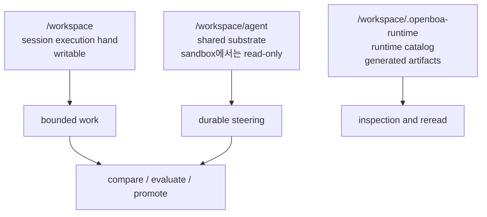
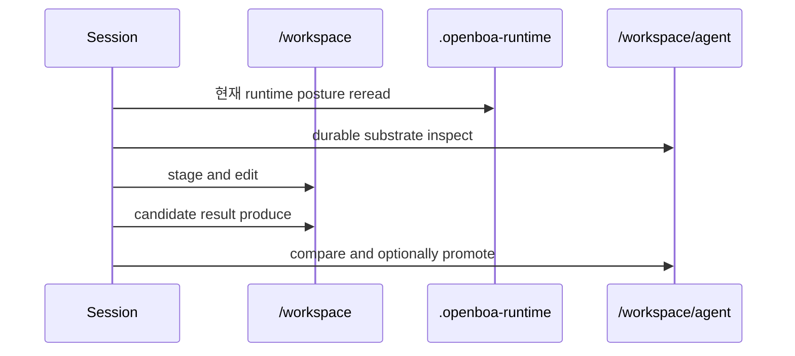

# 에이전트 워크스페이스


이 페이지는 openboa `Agent`의 파일시스템 surface를 설명합니다.

이 페이지가 답하는 질문은 다음과 같습니다.

- Agent는 실제로 어디서 일하는가
- 한 session에서 무엇이 writable한가
- 여러 session에 걸쳐 무엇이 shared한가
- `.openboa-runtime`에는 무엇이 있는가
- `/workspace`와 `/workspace/agent`는 왜 다른가

## 이 페이지가 필요한 이유

Agent가 filesystem-native runtime이라면, 단순히 “workspace가 있다” 정도로는 충분하지 않습니다.

실제로는 서로 다른 목적을 가진 surface가 나뉘어 있습니다.

- session execution hand
- shared Agent substrate
- runtime catalog

이 세 가지를 구분하지 않으면:

- current work
- shared durable steering
- runtime self-inspection

이 한 덩어리처럼 보이게 됩니다.

## 세 가지 워크스페이스 surface



## `/workspace`: session execution hand

`/workspace`는 현재 session이 실제로 일하는 writable hand입니다.

여기서 하는 일은:

- shared file을 stage해서 수정
- temporary working file 생성
- bounded shell command 실행
- current-session output inspection과 revision

중요한 원칙은:

- 여기서는 자유롭게 일하되
- 이것을 곧바로 global durable truth로 취급하지 않는 것

입니다.

## `/workspace/agent`: shared substrate

`/workspace/agent`는 한 Agent identity의 durable shared substrate입니다.

여기에는 보통 다음이 들어 있습니다.

- `AGENTS.md`
- `SOUL.md`
- `TOOLS.md`
- `IDENTITY.md`
- `USER.md`
- `HEARTBEAT.md`
- `BOOTSTRAP.md`
- `MEMORY.md`

즉 shared steering과 durable Agent memory가 여기 있습니다.

normal sandbox hand에서는 이 mount가 read-only입니다.

이건 Agent를 약하게 만들기 위한 것이 아니라, shared mutation을 explicit하게 만들기 위한 설계입니다.

## `.openboa-runtime`: runtime catalog

런타임은 현재 session 상태를 file처럼 다시 읽을 수 있도록:

```text
/workspace/.openboa-runtime/
```

아래에 여러 artifact를 materialize합니다.

예:

- environment posture
- mounted resource catalog
- managed tool contract
- outcome / outcome grade / evaluation
- context budget
- event feed / wake traces
- shell state / history / last output
- permission posture

이 카탈로그 덕분에 Agent는 prompt 밖에서도 자기 상태를 파일시스템에서 다시 읽을 수 있습니다.

## 왜 이 split이 중요한가

이 split은 네 가지를 동시에 만족시킵니다.

1. Agent가 실제 파일시스템 위에서 일하는 감각을 유지
2. 한 session이 shared mutation 없이도 생산적으로 작업 가능
3. durable shared steering 보호
4. prompt 밖에서도 runtime observability 유지

## 일반적인 흐름



## 관련 문서

- [에이전트 런타임](../agent-runtime.md)
- [에이전트 부트스트랩](./bootstrap.md)
- [에이전트 리소스](./resources.md)
- [에이전트 샌드박스](./sandbox.md)
